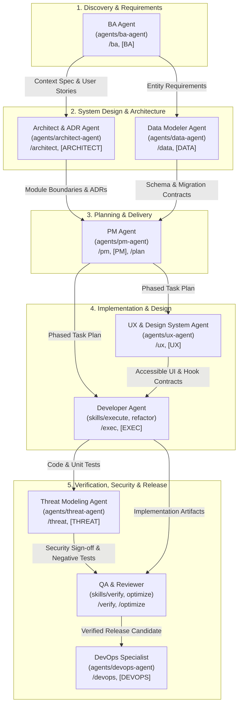

# Coding Lifecycle Agents Registry

This directory contains modular, role-specific **subagents** that coordinate and execute every phase of the software engineering lifecycle within the Context Factory ecosystem.

---

## Lifecycle Architecture & Flow

---

## Available Subagents

| Subagent | Path | Role & Capabilities | Primary Skills & Rules |
| :--- | :--- | :--- | :--- |
| **BA Agent** | [[agents/ba-agent/AGENT|`agents/ba-agent`]] | Clarifies ambiguous requirements, interviews the user, creates context specifications, user stories, domain definitions, and scenario test matrices. | `grill`, `grounding`, `context` |
| **Architect & ADR Agent** | [[agents/architect-agent/AGENT|`agents/architect-agent`]] | Evaluates system boundaries, dependency direction, SOLID principles conformance, and authors Architectural Decision Records (ADRs). | `adr`, `plan`, `verify`, `grounding` |
| **Data Modeler Agent** | [[agents/data-agent/AGENT|`agents/data-agent`]] | Designs relational/document schemas, ESR composite indexing, forward/rollback migration scripts, cursor pagination, and repository isolation. | `verify`, `grounding`, `plan` |
| **PM Agent** | [[agents/pm-agent/AGENT|`agents/pm-agent`]] | Breaks requirements into phased implementation plans, dependency-ordered phase files, milestone schedules, and execution progress tracking. | `plan`, `execute`, `adr`, `verify`, `refactor` |
| **UX & Design System Agent** | [[agents/ux-agent/AGENT|`agents/ux-agent`]] | Composes accessible UI components (WCAG 2.1 AA), design token systems, interaction feedback states, and encapsulates client state in custom hooks/stores. | `grounding`, `verify`, `refactor` |
| **Threat Modeling Agent** | [[agents/threat-agent/AGENT|`agents/threat-agent`]] | Conducts STRIDE threat modeling, audits trust boundaries, validates authentication/authorization policies, timing safety, and secrets hygiene. | `security`, `verify` |
| **DevOps Agent** | [[agents/devops-agent/AGENT|`agents/devops-agent`]] | Automates CI/CD pipelines (GitHub Actions, etc.), containerization (Docker, Compose), environment hygiene (`.env.example`), and release verification. | `security`, `verify`, `release-readiness` |

---

## Subagent Dispatch & Trigger Matrix

| When you need to... | Delegate To | Trigger Keywords / Prompts |
| :--- | :--- | :--- |
| Clarify ambiguous requirements, drill down on user stories, model domain terms, define edge cases | **BA Agent** | `/ba`, `[BA]`, `requirements`, `user story`, `acceptance criteria`, `grill me`, `discovery interview`, `pre-planning` |
| Analyze system boundaries, module dependencies, SOLID compliance, trade-offs, author ADRs | **Architect Agent** | `/architect`, `[ARCHITECT]`, `system design`, `module boundary`, `dependency direction`, `adr`, `solid` |
| Model database schemas, write migrations, test rollback runbooks, optimize ESR queries, paginate | **Data Agent** | `/data`, `[DATA]`, `database`, `schema`, `migration`, `rollback script`, `esr rule`, `query optimization` |
| Create task breakdowns, organize phase files, plan sprint milestones, track task completion | **PM Agent** | `/pm`, `[PM]`, `[PLAN]`, `implementation plan`, `plan`, `task breakdown`, `phase breakdown`, `milestone` |
| Compose accessible UI components (WCAG AA), theme design tokens, handle form validation, write custom hooks | **UX Agent** | `/ux`, `[UX]`, `frontend`, `ui`, `ux`, `design system`, `wcag`, `aria`, `custom hooks`, `zustand` |
| Audit trust boundaries, model STRIDE threats, verify auth/crypto timing safety, check secrets | **Threat Agent** | `/threat`, `[THREAT]`, `security`, `threat model`, `stride`, `trust boundary`, `auth audit`, `secrets hygiene` |
| Set up CI/CD workflows, Dockerize services, manage environment variables, check release readiness | **DevOps Agent** | `/devops`, `[DEVOPS]`, `ci/cd`, `pipeline`, `github actions`, `docker`, `docker-compose`, `deploy`, `release readiness` |

---

## How to Add New Subagents

The `agents/` directory is designed to be extensible. To add a new specialized agent:

1. Copy [[agents/templates/AGENT_TEMPLATE|`agents/templates/AGENT_TEMPLATE.md`]] to `agents/<new-agent-name>/AGENT.md`.
2. Populate the YAML frontmatter (`name`, `title`, `role`, `description`, `lifecycleStage`, `aliases`, `defaultWorkflow`, `skills`, `workflows`, `rules`, `handoffs`).
3. Create prompt templates under `agents/<new-agent-name>/prompts/` (`subagent-invocation.md`, `system-prompt.md`).
4. Update `context-manifest.json` under the `"agents"` inventory.
5. Link the new agent in `docs/Agents.md` and this `README.md`.
6. Run `node scripts/context.mjs lock && node scripts/context.mjs doctor`.

For full guidance on using these agents in day-to-day coding sessions across IDEs, consult the [[docs/guide/subagents-lifecycle|Subagents Lifecycle Guide]].
