# Coding Lifecycle Agents Registry

This directory contains modular, role-specific **subagents** that coordinate and execute every phase of the software engineering lifecycle within the Context Factory ecosystem.

---

## Lifecycle Architecture & Flow

```mermaid
flowchart LR
    subgraph S1["Discovery Phase"]
        BA["BA Agent<br/>(agents/ba-agent)"]
    end

    subgraph S2["Planning Phase"]
        PM["PM Agent<br/>(agents/pm-agent)"]
    end

    subgraph S3["Development Phase"]
        DEV["Developer / Architect<br/>(skills/execution-plan)"]
    end

    subgraph S4["Verification Phase"]
        QA["Reviewer / QA<br/>(skills/verification-review)"]
    end

    subgraph S5["Deployment Phase"]
        OPS["DevOps Agent<br/>(agents/devops-agent)"]
    end

    BA -->|"Acceptance Criteria & Scenarios"| PM
    PM -->|"Approved Phase Task Plan"| DEV
    DEV -->|"Code & Unit Tests"| QA
    QA -->|"Verified Release Gate"| OPS
    OPS -->|"CI/CD & Live Deployment"| DONE["Production Ready"]
```

---

## Agent Directory & Responsibilities

| Agent | Directory | Role & Responsibility | Core Skills & Workflows |
| :--- | :--- | :--- | :--- |
| **BA Agent** | [[agents/ba-agent/AGENT|`agents/ba-agent`]] | Clarifies business requirements, conducts discovery grilling interviews, creates user scenario coverage tables, and defines verifiable acceptance criteria. | `grill-with-docs`, `knowledge-grounding`, `zod-schema-modeling`, `feature-delivery` |
| **PM Agent** | [[agents/pm-agent/AGENT|`agents/pm-agent`]] | Breaks requirements into phased implementation plans, dependency-ordered phase files, milestone schedules, and execution progress tracking. | `implementation-plan`, `execution-plan`, `architecture-decision`, `verification-review` |
| **DevOps Agent** | [[agents/devops-agent/AGENT|`agents/devops-agent`]] | Automates CI/CD pipelines (GitHub Actions, etc.), containerization (Docker, Compose), environment hygiene (`.env.example`), and release verification. | `release-readiness`, `security-sensitive-change`, `security-review`, `dependency-upgrade` |

---

## Subagent Dispatch & Trigger Matrix

| When you need to... | Delegate To | Trigger Keywords / Prompts |
| :--- | :--- | :--- |
| Clarify ambiguous requirements, drill down on user stories, model domain terms, define edge cases | **BA Agent** | `requirements`, `user story`, `acceptance criteria`, `grill me`, `discovery interview`, `pre-planning` |
| Create task breakdowns, organize phase files, plan sprint milestones, track task completion | **PM Agent** | `implementation plan`, `plan`, `task breakdown`, `phase breakdown`, `milestone`, `track progress` |
| Set up CI/CD workflows, Dockerize services, manage environment variables, check release readiness | **DevOps Agent** | `ci/cd`, `pipeline`, `github actions`, `docker`, `docker-compose`, `deploy`, `release readiness` |

---

## How to Add New Subagents

The `agents/` directory is designed to be scalable. To add a new specialized agent (e.g. `qa-agent`, `security-agent`, `data-agent`):

1. Copy [[agents/templates/AGENT_TEMPLATE|`agents/templates/AGENT_TEMPLATE.md`]] to `agents/<new-agent-name>/AGENT.md`.
2. Populate the YAML frontmatter (`name`, `title`, `role`, `description`, `lifecycleStage`, `skills`, `workflows`).
3. Create prompt templates under `agents/<new-agent-name>/prompts/`.
4. Update `context-manifest.json` under the `"agents"` inventory.
5. Link the new agent in `docs/Agents.md` and this `README.md`.
6. Run `node scripts/context.mjs lock && node scripts/context.mjs doctor`.

For full guidance on using these agents in day-to-day coding sessions across IDEs, consult the [[docs/guide/subagents-lifecycle|Subagents Lifecycle Guide]].
