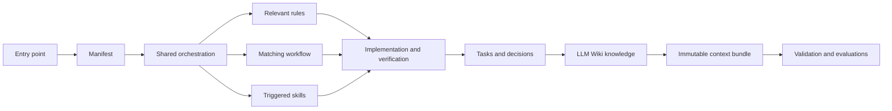

# Context Factory Architecture

## Purpose

The factory separates stable project knowledge from task-specific context so agents load enough guidance to work consistently without loading everything on every request.

## Layers

| Layer | Source | Responsibility |
|---|---|---|
| Inventory | `context-manifest.json` | Versioned list of canonical context files |
| Entry points | `README.md`, `AGENTS.md` | Discovery and minimum startup instructions |
| Orchestration | `orchestrator/SHARED.md` | Model-neutral load order and working contract |
| Adapters | `orchestrator/{AGENTS,CLAUDE,GEMINI}.md` | Thin model-specific presentation guidance |
| Rules | `rules/{global,backend,frontend}/` | Scoped engineering constraints |
| Skills | `skills/*/SKILL.md`, references, agents | Triggered procedures with progressively disclosed resources and synchronized interface metadata |
| Workflows | `workflows/*.md` | Multi-stage lifecycle orchestration, quality gates, and stop conditions |
| Knowledge | `knowledge/*.md`, `docs/` | Attributable LLM knowledge, Obsidian maps, tasks, and decisions |
| Schemas | `schemas/*.json` | Machine-readable knowledge and project-profile contracts |
| Templates and decisions | `docs/templates/`, `docs/decisions/` | Valid artifact shapes and durable architectural history |
| Harness | `scripts/context.mjs` | Deterministic resolution, bundles, traces, lock generation, and evaluations |
| Automation | `.github/workflows/context-factory.yml` | Cross-platform health enforcement on pushes and pull requests |
| Validation | `scripts/validate-context.mjs`, `evals/` | Structural, semantic, link, lock, vault, and behavioral checks |

## Context flow

## Invariants

- The root directory is the Obsidian vault.
- The manifest contains every orchestrator, rule, skill, skill resource, and index note.
- Model adapters defer to one shared contract.
- Skill frontmatter contains only `name` and `description`.
- Workflow frontmatter contains `name`, `description`, and `scope`; workflow inventory and map match disk.
- Rule descriptions state scope; bodies state enforceable behavior and verification.
- Durable decisions and active task state live in the vault, not only in chat.
- Consequential claims use the evidence classes defined by the shared contract.
- Architecture follows project profiles and accepted decisions rather than model preference.
- Canonical knowledge has stable identity, authority, provenance, ownership, lifecycle, and review metadata.
- `context-lock.json` hashes the manifest and complete canonical inventory, excluding only the generated lock itself.

## Decisions

- [[docs/decisions/0001-vertical-backend-modules|Vertical backend modules]]
- [[docs/decisions/0002-task-appropriate-form-surfaces|Task-appropriate form surfaces]]
- [[docs/decisions/0003-first-class-development-workflows|First-class development workflows]]
- [[docs/decisions/0004-deterministic-context-harness|Deterministic context harness]]
