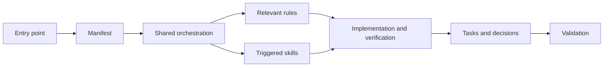

# Context Factory Architecture

## Purpose

The factory separates stable project knowledge from task-specific context so agents load enough guidance to work consistently without loading everything on every request.

## Layers

| Layer | Source | Responsibility |
|---|---|---|
| Inventory | `context-manifest.json` | Versioned list of canonical context files |
| Entry points | `README.md`, `AGENTS.md` | Discovery and minimum startup instructions |
| Orchestration | `orchestrator/SHARED.md` | Model-neutral load order and working contract |
| Adapters | `orchestrator/{AGENTS,CLAUDE,GEMINI}.md` | Thin model-specific presentation guidance |
| Rules | `rules/{global,backend,frontend}/` | Scoped engineering constraints |
| Skills | `skills/*/SKILL.md` | Triggered reusable workflows with progressive disclosure |
| Knowledge | `docs/` | Obsidian indexes, tasks, decisions, and durable project context |
| Validation | `scripts/validate-context.mjs` | Inventory, metadata, links, and vault consistency checks |

## Context flow

## Invariants

- The root directory is the Obsidian vault.
- The manifest contains every orchestrator, rule, skill, and index note.
- Model adapters defer to one shared contract.
- Skill frontmatter contains only `name` and `description`.
- Rule descriptions state scope; bodies state enforceable behavior and verification.
- Durable decisions and active task state live in the vault, not only in chat.
