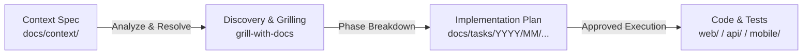

# Context Specifications (`docs/context/`)

The `docs/context/` directory stores **raw feature briefs, product requirements, bug reports, and domain contexts** before converting them into actionable implementation plans.

Writing a dedicated `.md` context file allows you or your AI IDE agent to inspect complete requirements, trace constraints, and automatically trigger the `implementation-plan` skill to generate phased tasks under `docs/tasks/`.

---

## The Workflow & Mental Model



1. **Write Context:** Create a `.md` specification in `docs/context/` outlining the problem, requirements, constraints, and scope (use [[docs/templates/Context|Context Template]]).
2. **Feed to AI IDE:** Prompt the agent with the context file.
3. **Generate Plan:** The agent analyzes the context, checks codebase constraints, and generates a structured task in `docs/tasks/YYYY/MM/YYYY-MM-DD/<id>-<type>-<feature>/`.
4. **Execute:** Run the generated phase files (`phase-01-*.md`, `phase-02-*.md`) with verification gates.

---

## How to Structure Your Context Files

Depending on your team size, project type, and delivery cadence, you can organize context files using one of the following industry-standard patterns:

### Option 1: Feature / Domain-Based (Recommended for Product Development)

Organize files by functional domain or product feature. Best for long-term clarity and finding context related to a specific subsystem.

```text
docs/context/
├── README.md
├── auth/
│   ├── social-login.md
│   └── mfa-totp.md
├── billing/
│   ├── stripe-subscription-checkout.md
│   └── invoice-pdf-generation.md
└── notifications/
    └── push-notification-preferences.md
```

### Option 2: Date / Chronological (Recommended for Fast Sprints & Logs)

Organize files by year, month, and date, mirroring the structure in `docs/tasks/`. Best for agile sprints, daily workflows, and historical traceability.

```text
docs/context/
├── README.md
└── 2026/
    ├── 08/
    │   ├── 2026-08-15-social-login.md
    │   └── 2026-08-16-stripe-checkout.md
    └── 09/
        └── 2026-09-01-bulk-user-export.md
```

### Option 3: Lifecycle / Status-Based (Recommended for Staged Planning)

Group context files by their planning and execution status.

```text
docs/context/
├── README.md
├── drafts/       # Rough ideas, unrefined briefs, raw notes
├── ready/        # Polished context ready for implementation planning
└── archived/     # Planned or executed contexts (links to docs/tasks/)
```

### Option 4: Hybrid Standard (Recommended for Large Projects)

A combination that separates product features from defects and tech debt:

```text
docs/context/
├── README.md
├── features/             # Major features organized by domain
│   ├── auth/
│   └── billing/
├── fixes/                # Bug context & reproduction steps
│   └── 2026-08-15-session-timeout-fix.md
└── refactors/            # Architectural cleanups & migrations
    └── database-kysely-migration.md
```

---

## Recommended Context Document Structure

Use the [[docs/templates/Context|Context Template]] (`docs/templates/Context.md`) as your base. A high-quality context document should include:

| Section | Purpose |
|---|---|
| **Frontmatter** | Title, status (`draft`, `ready`, `planned`, `superseded`), date, tags, and target feature. |
| **Overview & Objective** | Problem statement, user/business value, and measurable success criteria. |
| **Requirements & User Stories** | Detailed user scenarios, acceptance criteria, and edge cases. |
| **Technical Context** | Affected modules (`web/`, `api/`, `mobile/`), existing files/endpoints, schema changes, and security notes. |
| **UI/UX Guidelines** | Component reuse, design tokens, loading/error states, and user feedback. |
| **Scope & Non-Goals** | Boundaries defining what is in-scope vs. explicitly excluded. |
| **References** | Links to ADRs ([[docs/decisions/README|Decisions]]), Figma, PRDs, or external documentation. |

---

## IDE & AI Agent Prompting Guide

Once your context file is created in `docs/context/`, use one of the prompt patterns below in your AI assistant or IDE chat:

### 1. Generating an Implementation Plan
> *"Analyze the context in `docs/context/features/auth/social-login.md` and create a phased implementation plan under `docs/tasks/` using the `implementation-plan` skill."*

### 2. Pre-Planning Discovery (When Requirements Have Ambiguity)
> *"Read `docs/context/billing/stripe-subscription-checkout.md`. Use `grill-with-docs` to identify open questions and edge cases before creating the plan."*

### 3. Quick Bug Fix / Refactor Context
> *"Inspect the bug context in `docs/context/fixes/2026-08-15-session-timeout-fix.md` and follow the `defect-resolution` workflow."*

---

## Links & Related Resources

- **Template:** [[docs/templates/Context|Context Specification Template]]
- **Tasks Archive:** [[docs/tasks/README|Tasks Index]]
- **Decision Records:** [[docs/decisions/README|Architecture Decision Records]]
- **Skills Reference:** [[docs/Skills|Skills]]
