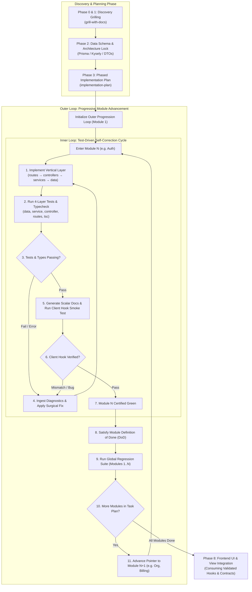

# New Project Workflow — Progressive, Backend-First, Contract-Driven & Loop-Engineered

## Purpose & Philosophy

Building a production-grade software system requires a disciplined, contract-driven approach that avoids the two primary failure modes of modern application engineering:
1. **The "One-Tap / Big-Bang" Fallacy:** Attempting to generate or scaffold an entire multi-module system in a single massive prompt or monolithic pass. This inevitably produces unverified assumptions, drifting database types, broken endpoint contracts, missing test coverage, and fragile architectures that collapse during integration.
2. **Premature UI Construction:** Drafting frontend views and components before the underlying database schemas, service boundaries, and API contracts are locked and tested, forcing the frontend to hallucinate data shapes and state behaviors.

---

## Loop-Engineering Architecture

This workflow operates on a dual-loop engineering model: the **Inner Loop** (micro self-healing cycle per layer) and the **Outer Loop** (macro progressive module advancement).



### 1. The Inner Loop (Micro Self-Correction Cycle)
Within each module, engineering proceeds in an automated, closed-loop cycle:
$$\text{Implement Layer} \longrightarrow \text{Execute 4-Layer Tests} \longrightarrow \text{Typecheck} \longrightarrow \text{Diagnose Failures} \longrightarrow \text{Surgical Fix} \longrightarrow \text{Green}$$

- **High Diagnostic Precision:** Layered test files (`*.data.test.ts`, `*.service.test.ts`, `*.controller.test.ts`, `*.routes.test.ts`) isolate failures immediately to a single tier (e.g. transport parsing vs. database constraint).
- **Client Hook Smoke Circuit Breaker:** The generated React Query / Mutation hook (`use<Feature>Query`, `use<Feature>Mutation`) is smoke-tested against the live endpoint. If payload decoding, error handling, or cache invalidation fails, the loop self-corrects before the module is declared complete.

### 2. The Outer Loop (Macro Module Progression)
Across modules, the engine progresses sequentially:
1. Read the next phase from `docs/tasks/` (e.g. Module $N$: Auth).
2. Execute the Inner Loop until all 4 test layers and hook smoke tests pass.
3. Check off the Definition of Done in the task tracking file.
4. Execute full regression testing across all previously completed modules ($1 \dots N$).
5. Advance to Module $N+1$ (e.g. Organization, Billing) and repeat.

---

## Non-Negotiable Guardrails

- **Grill before Planning:** `@skills/grill/SKILL.md` must be executed and audited before generating any implementation plan with `@skills/plan/SKILL.md`. Never plan on unverified assumptions.
- **Strict Progressive Delivery (Anti-One-Tap):** Never attempt to generate all project modules simultaneously. Build one vertical module slice at a time (e.g., finish `auth` completely, verify it, lock it, then proceed to `tenants`, then `users`).
- **Backend & Architecture Foundation First:** Solid backend boundaries (`routes → controllers → services → data` + DTOs) must be established, verified, and locked before UI code is drafted.
- **Layer-by-Layer Backend Testing:** Every module must include explicit test files covering all 4 architectural tiers: data access, service policies, controller validation/mapping, and route/HTTP integration.
- **Closed-Loop Verification:** Every layer change must run through the automated inner test/typecheck loop before advancing.
- **End-to-End Client Hook Validation:** Before complex UI screens are constructed, build and execute lightweight, typed query hooks (`use<Feature>Query`) or mutation hooks (`use<Feature>Mutation`) to validate that the backend contract and client communication work end-to-end.
- **No Invented Contracts:** If a field, parameter, or status code is not present in the Prisma schema, Kysely types, or Scalar API documentation, it does not exist. Update the backend contract first.
- **Phase Gating:** Do not advance to Phase $N+1$ until all deliverables and verification checks for Phase $N$ are recorded and passing.

---

## Step-by-Step Workflow Phases

### Phase 0 — Pre-Planning Discovery & Requirements Grilling
Before writing code or committing to architectural designs, resolve ambiguity by conducting a structured discovery interview:
- What user need or business outcome does this system/feature solve?
- What are the explicit actors, permission boundaries, and authority levels?
- What existing architectural patterns exist in this codebase (conventions, naming, error envelope, auth model)?
- What are the system constraints (multi-tenancy, rate limits, compliance, external APIs)?
- What are the non-goals, failure modes, and recovery mechanisms?

**Output:** A structured pre-planning brief. Label unverified statements as explicit unknowns.

---

### Phase 1 — Grill the Docs & Codify Decisions
Invoke **`@skills/grill/SKILL.md`**.
1. Inspect repository documentation, existing schemas, configurations, and decisions before asking questions the codebase already answers.
2. Interrogate open requirements **one question at a time**, explaining why each question matters and presenting a recommended option with trade-offs.
3. Establish canonical domain vocabulary in the project glossary (following `references/glossary-format.md`).
4. Record material architectural trade-offs in Architecture Decision Records under `docs/decisions/`.
5. Perform a coverage audit to confirm that all primary journeys, edge cases, and failure scenarios are bounded.

**Output:** Audited discovery record, decision ledger, and glossary updates. **Stop before implementation planning.**

---

### Phase 2 — Architecture & Database Schema First
Design and lock the data layer and contract definitions before creating any operational business logic:
- **Entity Relationship Model:** Define entity tables, primary/foreign keys, cascades, enums, and indexes.
- **Prisma Schema Draft:** Author the canonical schema definition (`schema.prisma`) defining models, constraints, and relations.
- **Kysely Query Layer:** Establish typed database interfaces, join expectations, views, and migration scripts.
- **Boundary DTOs:** Define runtime transport schemas (Zod) ensuring validation matches database constraints exactly.

This schema serves as the **single source of truth** for all downstream layers.

---

### Phase 3 — Phased Implementation Plan
Invoke **`@skills/plan/SKILL.md`**, utilizing the outputs of Phases 0–2:
- Author the Master Plan (`README.md` using `docs/templates/Task.md`) under `docs/tasks/YYYY/MM/YYYY-MM-DD/<id>-<type>-<feature>/`.
- Author individual Phase Breakdown artifacts (`phase-01-<module>.md`, `phase-02-<module>.md`, etc. using `docs/templates/Phase.md`).
- Sequence feature modules in strict vertical dependency order:
  1. `Phase 01: Core Infrastructure & Base DB Migration`
  2. `Phase 02: Module 1 (e.g. Auth & Identity)`
  3. `Phase 03: Module 2 (e.g. Organization / Multi-Tenancy)`
  4. `Phase 04: Module 3 (e.g. Primary Domain Feature)`
  5. `Phase 05: Frontend UI Views & Integration`
- Include explicit verification checklists, affected file paths, and rollback plans for each phase. **Stop and obtain user review before executing.**

---

### Phase 4 — Vertical Backend Module Construction (Per Module)
For each module in the sequenced plan, build strictly within the vertical architecture defined in `rules/backend/module-architecture.md`:

```text
src/modules/<feature>/
├── dto/
│   └── <feature>.dto.ts          # Zod input/output schemas & inferred TypeScript types
├── data/
│   ├── <feature>.data.ts         # Query functions & database adapter calls
│   ├── create-<feature>.data.ts
│   ├── update-<feature>.data.ts
│   └── delete-<feature>.data.ts
├── services/
│   ├── create-<feature>.service.ts # Business policies, transactions & authorization
│   ├── update-<feature>.service.ts
│   └── delete-<feature>.service.ts
├── controllers/
│   ├── create-<feature>.controller.ts # DTO validation & HTTP response/status mapping
│   ├── update-<feature>.controller.ts
│   └── delete-<feature>.controller.ts
└── <feature>.routes.ts           # Route registrations & middleware composition
```

**Unidirectional Dependency Flow:** `routes → controllers → services → data`.
- Lower layers never import higher layers.
- Modules interact with other modules exclusively via public service interfaces, never by reaching into another module's internal data layer.

---

### Phase 5 — Mandatory Layer-by-Layer Test Suite (Inner Loop TDD)
Every vertical module must execute through the **Inner Loop** with comprehensive test files covering every architectural layer:

1. **Data Layer Tests (`*.data.test.ts`):**
   - Verify isolated database queries, constraint violations, transaction commits, rollbacks, pagination slicing, and soft deletions against a test database (`rules/database/testing-data-access-layer.md`).
2. **Service Layer Tests (`*.service.test.ts`):**
   - Verify core business policies, authorization rules, state transitions, and error branches using deterministic mocks or fakes for data access.
3. **Controller Layer Tests (`*.controller.test.ts`):**
   - Verify that incoming HTTP payloads are validated against Zod DTOs, invalid fields are rejected with structured error details, and responses are mapped to correct HTTP status codes (`200`, `201`, `400`, `404`, `409`, `422`).
4. **Route / Integration Tests (`*.routes.test.ts`):**
   - Verify complete HTTP transport execution, authentication guards, role middleware, rate limiting, and standard error payload envelopes.

If any test fails or compiler error is detected, the inner loop immediately ingests the error diagnostic, applies a surgical fix, and re-executes until 100% green.

---

### Phase 6 — Scalar API Contract Docs & Client Hook Validation
Once backend module tests pass, expose and smoke-test the contract from the client perspective:

1. **Interactive Scalar API Documentation:**
   - Expose the newly built endpoints in Scalar (OpenAPI spec) with typed request parameters, response bodies, and error response shapes.
   - Verify that types and descriptions are fully browsable and accurate.
2. **Lightweight Frontend Query / Mutation Hooks:**
   - Create typed query hooks (`use<Feature>Query`) for read operations adhering to `rules/hooks/query-hooks.md`.
   - Create typed mutation hooks (`use<Feature>Mutation`) for write operations adhering to `rules/hooks/mutation-hooks.md`, complete with cache invalidation rules and optimistic/rollback patterns.
3. **Client Contract Smoke Test:**
   - Execute a minimal validation test calling the frontend hook against the live/mock API to prove payload encoding, response parsing, error state propagation, and React query cache handling.

---

### Phase 7 — Outer Loop Gate Sign-Off & Module Promotion
Evaluate the module against the **Definition of Done**:
1. Check off all verification criteria for Module $N$ in `docs/tasks/`.
2. Run global regression tests covering Modules $1 \dots N$.
3. Advance the Outer Loop pointer to Module $N+1$ in the implementation plan (e.g., move from `auth` to `organization`).
4. Repeat Phases 4–7 until all backend domain modules are complete and validated.

---

### Phase 8 — Frontend UI & View Integration
Once all required backend modules have passed Phase 7 sign-off:
- Build UI components, screens, modals, and forms consuming the validated frontend hooks and Scalar contracts.
- Adhere to `rules/ui/frontend.md` for aesthetics, micro-interactions, responsive layouts, and loading/empty/error states.
- Under no circumstances should UI code invent fields or mock endpoints that were not delivered and signed off in backend phases.

---

## Definition of Done (DoD) Checklist

For each module to be certified complete, every item below must be verified with reproducible evidence:

- [ ] **Discovery & Grilling:** Pre-planning questions resolved, glossary updated, and ADRs recorded (`@skills/grill`).
- [ ] **Data Schema Locked:** Prisma model / Kysely types applied and verified via migrations.
- [ ] **Implementation Plan Approved:** Sequenced phase files exist under `docs/tasks/` (`@skills/plan`).
- [ ] **Vertical Architecture Implemented:** `dto`, `data`, `services`, `controllers`, `routes` adhere to `rules/backend/module-architecture.md`.
- [ ] **Inner Loop 4-Layer Tests Passing:**
  - [ ] `*.data.test.ts` (database constraints, queries, transactions)
  - [ ] `*.service.test.ts` (business policy, auth rules, edge cases)
  - [ ] `*.controller.test.ts` (DTO validation, HTTP status mapping)
  - [ ] `*.routes.test.ts` (route middleware, auth guards, integration)
- [ ] **Contract Documented:** Scalar API docs live with complete request/response schemas.
- [ ] **Frontend Hook Validated:** Typed `useQuery` / `useMutation` hooks built and verified end-to-end.
- [ ] **Outer Loop Regression Green:** Global test suite across all completed modules passes cleanly with zero regressions.
- [ ] **Zero Type/Lint Errors:** Typecheck (`tsc --noEmit`) and linter pass with 0 errors.
- [ ] **Gate Sign-off:** Phase status marked complete in `docs/tasks/` before promoting to the next module.