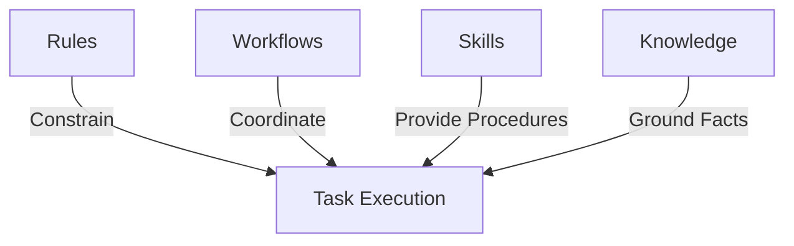

# Context Factory User Guide

Welcome to the Context Factory User Guide! This guide helps developers and AI agents understand how to interact with, use, and maintain the Context Factory.

The Context Factory is the centralized repository for **agent behavior, engineering rules, reusable skills, development workflows, and project knowledge**. It operates on a "progressive disclosure" architecture, ensuring that agents load exactly the context they need for a task without bloat.

## Core Concepts

The factory is organized into four main layers of context:



1. **Rules (`rules/`)**: Strict engineering constraints that enforce coding standards, naming conventions, security guardrails, and architecture.
2. **Workflows (`workflows/`)**: Stage-by-stage lifecycles that guide multi-phase tasks (e.g., feature delivery, defect resolution) with quality gates and stop conditions.
3. **Skills (`skills/`)**: Specialized procedures with predefined instructions, YAML prompts, and reference assets designed to help agents perform complex tasks.
4. **Knowledge (`knowledge/`)**: Attributable facts, contracts, and runbooks containing provenance and authority levels to ground agent claims.

---

## Guide Index

Explore the detailed guides below to learn how to trigger and use these factory elements:

- **[[docs/guide/skills|Skills Guide]]**: How to use and trigger specialized agent procedures, with prompt examples and explicit invocation details.
- **[[docs/guide/rules-and-workflows|Rules and Workflows Guide]]**: How the context resolver automatically selects rules and workflows, routing hints, and lifecycle phases.
- **[[docs/guide/cross-workspace-integration|Cross-Workspace Integration Guide]]**: How to use Context Factory across other repositories as a Git submodule, Git subtree, or symlink, and manage workspace scoping.

---

## Developer Quick Start

You can query the Context Factory harness to resolve or preview the context bundle generated for any developer request.

### 1. Resolve Context
To see which rules, skills, and workflow are matched for a given request:
```sh
node scripts/context.mjs resolve "implement user authentication endpoint"
```

### 2. Compile a Context Bundle
To build an immutable context bundle for a task:
```sh
node scripts/context.mjs bundle "implement user authentication endpoint"
```

### 3. Validate the Factory
To run structural checks, verify frontmatter, and check that the context lock is up-to-date:
```sh
node scripts/context.mjs doctor
```

For more detailed architecture information, see [[docs/ARCHITECTURE|Context Factory Architecture]].
