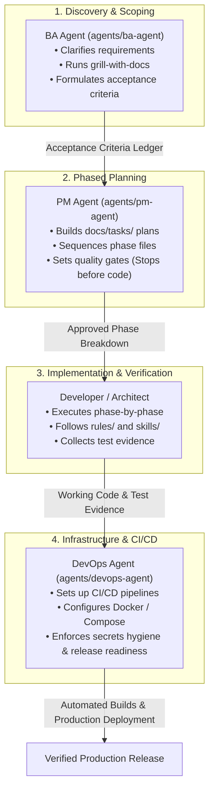

# Coding Lifecycle Subagents Guide

This guide explains how to use the **Coding Lifecycle Subagents** (`ba-agent`, `pm-agent`, `devops-agent`) in your day-to-day software development workflows with Context Factory.

---

## 1. Overview & Architecture

Modern software development consists of distinct phases: **Discovery & Requirements**, **Task Planning**, **Implementation**, **Verification**, and **Infrastructure / Deployment**. 

Instead of treating an AI agent as a single undifferentiated assistant that tries to do everything at once (often jumping into code prematurely or making invalid assumptions), Context Factory organizes development into **specialized lifecycle subagents**:



---

## 2. Agent Directory & Responsibilities

### [[agents/ba-agent/AGENT|Business Analyst Agent (`ba-agent`)]]
- **Role:** Business Analyst & Requirements Engineer.
- **When to Use:** At the very start of any new feature, product idea, or ambiguous request.
- **Key Actions:**
  - Asks **one** clarifying question at a time using `skills/grill/SKILL.md`.
  - Establishes domain language in `knowledge/` using `skills/grounding/SKILL.md`.
  - Generates a **Scenario Coverage Matrix** and **Acceptance Criteria Ledger**.
  - **Rule:** Never writes implementation code; ensures requirements are rock solid first.

### [[agents/pm-agent/AGENT|Project Manager Agent (`pm-agent`)]]
- **Role:** Project Manager & Sprint Coordinator.
- **When to Use:** When requirements are understood and need to be organized into actionable, phased development tasks.
- **Key Actions:**
  - Decomposes work into bite-sized phases (`phase-01-...md`, `phase-02-...md`) in `docs/tasks/` using `docs/templates/Task.md` and `docs/templates/Phase.md`.
  - Enforces dependencies, file target mapping, and verification commands per phase.
  - **Gate:** Presents the master plan and **stops before coding** until approved.
  - Tracks execution progress, logs deviations, and closes completed tasks.

### [[agents/devops-agent/AGENT|DevOps & Infrastructure Agent (`devops-agent`)]]
- **Role:** DevOps Engineer & Infrastructure Specialist.
- **When to Use:** When automating builds, setting up CI/CD, configuring containers, managing environment configs, or preparing production releases.
- **Key Actions:**
  - Authors GitHub Actions workflows (`.github/workflows/ci.yml`, `deploy.yml`).
  - Writes production-ready `Dockerfile` (multi-stage, non-root user) and `docker-compose.yml`.
  - Enforces `.env.example` hygiene and protects against accidental secrets exposure (`rules/global/security-guardrails.md`).
  - Executes `workflows/release-readiness.md` and pre-flight checklists.

---

## 3. How to Use Subagents in Your IDE

### In Antigravity IDE

1. **Subagent Persona Delegation:**
   When starting a prompt, explicitly invoke the subagent persona and reference its contract:
   ```markdown
   Act as the BA Agent (@agents/ba-agent/AGENT.md).
   I want to add OAuth2 social logins to our application.
   Please grill me on provider requirements, session handling, and failure flows.
   ```
2. **Phase Execution:**
   ```markdown
   Act as the PM Agent (@agents/pm-agent/AGENT.md).
   Break down the OAuth2 implementation into 3 ordered phases under `docs/tasks/`.
   ```
3. **CI/CD Automation:**
   ```markdown
   Act as the DevOps Agent (@agents/devops-agent/AGENT.md).
   Generate a GitHub Actions workflow to run linting, tests, and Docker build on PRs.
   ```

---

### In Cursor (Composer & Chat)

1. Mention the agent definition file using `@`:
   ```markdown
   @agents/devops-agent/AGENT.md
   Help me create a docker-compose.yml file for our backend and PostgreSQL database.
   ```
2. You can also add custom `.cursorrules` or Agent Prompts pointing to `agents/` for quick switching.

---

### In Claude Code & CLI Tools

1. Reference the portable system prompts located in `agents/<agent-name>/prompts/system-prompt.md`:
   ```sh
   # Invoke with BA context
   claude --system-prompt "$(cat agents/ba-agent/prompts/system-prompt.md)" "Design requirements for multi-tenant billing"
   ```
2. Or use the prompt snippets from `agents/<agent-name>/prompts/subagent-invocation.md`.

---

## 4. End-to-End Walkthrough Example

Here is a practical example of how the three agents collaborate on a feature from inception to deployment:

### Step 1: Requirements Discovery (BA Agent)
- **User Prompt:** *"I want to add webhook event notifications when an order is created."*
- **BA Agent Action:**
  - Invokes `skills/grill/SKILL.md`.
  - Asks: *"What delivery retry strategy and timeout policy should we use for failed webhook deliveries?"*
  - Asks: *"How should outgoing webhooks be cryptographically signed (e.g. HMAC-SHA256 with a secret)?"*
  - Output: Records the resolved decisions in `docs/tasks/2026/08/2026-08-18/feat-order-webhooks/README.md` with complete scenario coverage and acceptance criteria.

### Step 2: Phased Planning (PM Agent)
- **User Prompt:** *"The requirements look great. Create an implementation plan."*
- **PM Agent Action:**
  - Ingests the BA pre-planning record.
  - Generates:
    - `phase-01-database-and-models.md` (Webhook subscriptions schema & migration).
    - `phase-02-dispatcher-service.md` (Event emitter, retry queue & HMAC signing).
    - `phase-03-api-routes-and-tests.md` (CRUD endpoints for webhook subscriptions & integration tests).
  - Stops and presents the plan for user approval.

### Step 3: Implementation & Verification (Developer)
- Developer agent executes `phase-01`, `phase-02`, and `phase-03` sequentially using `skills/execute/SKILL.md`, stopping at each phase for developer review and verification.

### Step 4: CI/CD & Deployment (DevOps Agent)
- **User Prompt:** *"We're ready to deploy. Setup the CI/CD pipeline and release checks."*
- **DevOps Agent Action:**
  - Authors `.github/workflows/webhooks-ci.yml`.
  - Configures environment variable placeholders in `.env.example` (`WEBHOOK_SIGNING_SECRET=xxx`).
  - Runs `workflows/release-readiness.md` to verify all test suites and security guardrails pass.

---

## 5. Adding New Subagents (Extensibility)

To scale the architecture with more specialized agents (e.g. `qa-agent`, `security-agent`, `mobile-agent`):

1. **Use the Template:** Copy [[agents/templates/AGENT_TEMPLATE|`agents/templates/AGENT_TEMPLATE.md`]] into `agents/<new-agent-name>/AGENT.md`.
2. **Define Persona & Scope:** Specify triggers, input/output contracts, linked skills, and safety boundaries.
3. **Add Prompts:** Create `prompts/system-prompt.md` and `prompts/subagent-invocation.md`.
4. **Register in Inventory:** Add the files to `context-manifest.json` under `"agents"`.
5. **Sync & Validate:**
   ```sh
   node scripts/context.mjs lock
   node scripts/context.mjs doctor
   ```
