# Coding Lifecycle Subagents Guide

This guide explains how to use the **Coding Lifecycle Subagents** in your day-to-day software development workflows with Context Factory.

---

## 1. Overview & Architecture

Modern software development consists of distinct phases: **Discovery & Requirements**, **Architecture & System Design**, **Data Modeling**, **Phased Planning**, **Frontend & UX Design**, **Implementation**, **Threat Modeling & Security Verification**, and **Infrastructure / Deployment**. 

Instead of treating an AI agent as a single undifferentiated assistant that tries to do everything at once (often jumping into code prematurely or making invalid assumptions), Context Factory organizes development into **declarative, specialized lifecycle subagents**:

```mermaid
flowchart TD
    subgraph S1["1. Discovery & Scoping"]
        BA["BA Agent (agents/ba-agent)<br/>/ba, [BA]<br/>• Clarifies requirements<br/>• Runs grill-with-docs<br/>• Formulates acceptance criteria"]
    end

    subgraph S2["2. Architecture & Data Modeling"]
        ARCH["Architect & ADR Agent (agents/architect-agent)<br/>/architect, [ARCHITECT]<br/>• Module boundaries & SOLID<br/>• Authors ADRs (skills/adr)<br/>• Decouples dependency graphs"]
        DATA["Data Modeler Agent (agents/data-agent)<br/>/data, [DATA]<br/>• Relational/document schemas<br/>• ESR indexing & cursor pagination<br/>• Migrations & rollback runbooks"]
    end

    subgraph S3["3. Phased Task Planning"]
        PM["PM Agent (agents/pm-agent)<br/>/pm, [PM], /plan<br/>• Builds docs/tasks/ plans<br/>• Sequences phase files<br/>• Quality gates (Stops before code)"]
    end

    subgraph S4["4. UX & Component Craft"]
        UX["UX & Design System Agent (agents/ux-agent)<br/>/ux, [UX]<br/>• WCAG 2.1 AA accessibility<br/>• Design token composition<br/>• Custom hooks & state encapsulation"]
    end

    subgraph S5["5. Implementation & Refactoring"]
        DEV["Developer Agent (skills/execute, refactor)<br/>/exec, [EXEC]<br/>• Executes phase-by-phase<br/>• Adheres to rules/ and skills/<br/>• Collects reproducible test evidence"]
    end

    subgraph S6["6. Threat Modeling & Security"]
        THREAT["Threat Modeling Agent (agents/threat-agent)<br/>/threat, [THREAT]<br/>• STRIDE threat analysis<br/>• Trust boundaries & auth checks<br/>• Timing safety & secrets hygiene"]
    end

    subgraph S7["7. Infrastructure & Release"]
        QA["QA & Reviewer (skills/verify, optimize)<br/>/verify, /optimize<br/>• ESR query audits & regression checks"]
        OPS["DevOps Agent (agents/devops-agent)<br/>/devops, [DEVOPS]<br/>• CI/CD pipelines & Docker<br/>• Release readiness verification"]
    end

    BA -->|"Context Spec & Scenarios"| ARCH
    BA -->|"Entity Requirements"| DATA
    ARCH -->|"Module Boundaries & ADRs"| PM
    DATA -->|"Schema & Migration Contracts"| PM
    PM -->|"Phased Task Plan"| UX
    PM -->|"Phased Task Plan"| DEV
    UX -->|"Accessible UI & Hook Signatures"| DEV
    DEV -->|"Code & Unit Tests"| THREAT
    THREAT -->|"Security Sign-off & Negative Tests"| QA
    DEV -->|"Implementation Artifacts"| QA
    QA -->|"Verified Release Candidate"| OPS
    OPS -->|"Automated Builds & Deployment"| DONE["Verified Production Release"]
```



---

## 2. Agent Directory & Responsibilities

### [[agents/ba-agent/AGENT|Business Analyst Agent (`ba-agent`)]]
- **Role:** Business Analyst & Requirements Engineer.
- **Slash Commands & Prefixes:** `/ba`, `[BA]`, `[DISCOVERY]`
- **When to Use:** At the very start of any new feature, product idea, or ambiguous request.
- **Key Actions:**
  - Asks **one** clarifying question at a time using `skills/grill/SKILL.md`.
  - Establishes domain language in `knowledge/` using `skills/grounding/SKILL.md`.
  - Generates a **Scenario Coverage Matrix** and **Acceptance Criteria Ledger**.
  - **Rule:** Never writes implementation code; ensures requirements are rock solid first.

### [[agents/architect-agent/AGENT|Architect & ADR Specialist Agent (`architect-agent`)]]
- **Role:** Software Architect & Technical Lead.
- **Slash Commands & Prefixes:** `/architect`, `[ARCHITECT]`
- **When to Use:** When designing system modules, evaluating dependency direction, auditing SOLID principles, or authoring Architectural Decision Records (ADRs).
- **Key Actions:**
  - Audits vertical module boundaries and prevents cross-module layer leaks (`rules/typescript/backend/module-architecture.md`).
  - Evaluates designs against all 5 SOLID principles (`rules/solid/*`).
  - Applies the **1-3-1 rule** (1 recommendation, 3 options, 1 decision) to author ADRs in `docs/decisions/` (`skills/adr/SKILL.md`).
  - **Rule:** Never implements production code; defines boundaries and contracts.

### [[agents/data-agent/AGENT|Data Modeler & Database Architect Agent (`data-agent`)]]
- **Role:** Data Modeler & Database Architect.
- **Slash Commands & Prefixes:** `/data`, `[DATA]`
- **When to Use:** When designing database tables, creating forward/rollback migrations, optimizing slow queries (ESR rule), and structuring repository layers.
- **Key Actions:**
  - Structures relational and document schemas with strict typing (`rules/typescript/database/schema-db.md`).
  - Plans composite indexes via the **ESR rule** (Equality -> Sort -> Range) and mandates cursor pagination (`rules/typescript/database/query-optimization-and-pagination.md`).
  - Authors forward migration scripts paired with tested, non-destructive rollback scripts (`workflows/database-migration.md`).
  - Enforces repository isolation (`rules/typescript/database/data-access-via-db.md`).

### [[agents/pm-agent/AGENT|Project Manager Agent (`pm-agent`)]]
- **Role:** Project Manager & Sprint Coordinator.
- **Slash Commands & Prefixes:** `/pm`, `[PM]`, `/plan`, `[PLAN]`
- **When to Use:** When requirements and architecture are understood and need to be organized into actionable, phased development tasks.
- **Key Actions:**
  - Decomposes work into bite-sized phases (`phase-01-...md`, `phase-02-...md`) in `docs/tasks/` using `docs/templates/Task.md` and `docs/templates/Phase.md`.
  - Enforces dependencies, file target mapping, and verification commands per phase.
  - **Gate:** Presents the master plan and **stops before coding** until approved.
  - Tracks execution progress, logs deviations, and closes completed tasks.

### [[agents/ux-agent/AGENT|UX & Design System Specialist Agent (`ux-agent`)]]
- **Role:** UX & Design System Engineer.
- **Slash Commands & Prefixes:** `/ux`, `[UX]`
- **When to Use:** When designing user interfaces, accessible components, design token hierarchies, form validation feedback, and custom state hooks.
- **Key Actions:**
  - Enforces **WCAG 2.1 AA accessibility** (focus rings, ARIA roles, keyboard navigation, focus trapping) (`rules/typescript/ui/dialogs-and-overlays.md`).
  - Implements complete interaction feedback (Idle, Loading, Error, Success) and eliminates layout shift (CLS) (`rules/typescript/ui/interaction-feedback.md`).
  - Separates presentational JSX from async fetching by extracting custom hooks (`rules/typescript/hooks/custom-hooks.md`).

### [[agents/threat-agent/AGENT|Security & Threat Modeling Specialist Agent (`threat-agent`)]]
- **Role:** Security & Threat Modeling Specialist.
- **Slash Commands & Prefixes:** `/threat`, `[THREAT]`
- **When to Use:** When implementing authentication/authorization, handling webhooks/tokens, reviewing trust boundaries, or preparing security-sensitive changes.
- **Key Actions:**
  - Performs **STRIDE threat modeling** (Spoofing, Tampering, Repudiation, Information Disclosure, Denial of Service, Elevation of Privilege) (`skills/security/SKILL.md`).
  - Enforces constant-time cryptographic comparisons (`crypto.timingSafeEqual`) and secrets hygiene in `.env.example` (`rules/global/security-guardrails.md`).
  - Authors adversarial negative test cases expecting 401/403/400.

### [[agents/devops-agent/AGENT|DevOps & Infrastructure Agent (`devops-agent`)]]
- **Role:** DevOps Engineer & Infrastructure Specialist.
- **Slash Commands & Prefixes:** `/devops`, `[DEVOPS]`, `/release`, `[RELEASE]`
- **When to Use:** When automating builds, setting up CI/CD, configuring containers, managing environment configs, or preparing production releases.
- **Key Actions:**
  - Authors GitHub Actions workflows (`.github/workflows/ci.yml`, `deploy.yml`).
  - Writes production-ready `Dockerfile` (multi-stage, non-root user) and `docker-compose.yml`.
  - Enforces `.env.example` hygiene and protects against accidental secrets exposure (`rules/global/security-guardrails.md`).
  - Executes `workflows/release-readiness.md` and pre-flight checklists.

---

## 3. How to Use Subagents in Your IDE

### In Antigravity IDE

1. **Direct Slash Commands / Aliases:**
   Simply prefix your prompt with the agent slash command:
   ```markdown
   /architect Design the modular domain boundary for subscription billing.
   ```
   ```markdown
   /data Create the subscription billing schema with ESR indexes and a rollback script.
   ```
   ```markdown
   /ux Compose the subscription tier selection card with WCAG AA accessibility.
   ```
   ```markdown
   /threat Audit the Stripe webhook signature verification for timing attacks.
   ```

2. **Explicit Persona Delegation:**
   ```markdown
   Act as the Threat Agent (@agents/threat-agent/AGENT.md).
   Review our authentication middleware and CORS configuration.
   ```

---

### In Cursor (Composer & Chat)

1. Mention the agent definition file using `@`:
   ```markdown
   @agents/data-agent/AGENT.md
   Help me optimize and migrate our database schema for the orders table.
   ```
2. Or use bracket prefixes:
   ```markdown
   [ARCHITECT] Evaluate whether we should use Redis streams vs RabbitMQ for task queues.
   ```

---

### In Claude Code & CLI Tools

1. Reference the portable system prompts located in `agents/<agent-name>/prompts/system-prompt.md`:
   ```sh
   claude --system-prompt "$(cat agents/threat-agent/prompts/system-prompt.md)" "Review webhook handlers"
   ```
2. Or use the prompt snippets from `agents/<agent-name>/prompts/subagent-invocation.md`.

---

## 4. End-to-End Walkthrough Example

Here is a practical example of how all 7 agents collaborate on delivering a feature from inception to release:

### Step 1: Requirements Discovery (BA Agent)
- **Prompt:** `/ba I want to add webhook event notifications when an order is created.`
- **BA Agent:** Grills the user on event payload schemas, retry policies, and delivery guarantees; authors `docs/context/order-webhooks.md`.

### Step 2: Architecture & Decision Recording (Architect Agent)
- **Prompt:** `/architect Design the event dispatcher module boundary and evaluate delivery queues.`
- **Architect Agent:** Evaluates in-memory queue vs background worker, applies the 1-3-1 rule, authors `docs/decisions/0017-order-webhook-delivery-queue.md`, and defines clean module interfaces.

### Step 3: Database Modeling & Migrations (Data Agent)
- **Prompt:** `/data Model the webhook subscriptions and delivery attempts schema.`
- **Data Agent:** Designs tables with snake_case columns, plans composite index `(tenant_id, status, created_at)` via ESR, and authors forward/rollback SQL migration scripts.

### Step 4: Phased Task Planning (PM Agent)
- **Prompt:** `/pm Create an implementation plan based on the context, ADR, and schema.`
- **PM Agent:** Generates 4 sequential phases under `docs/tasks/.../`, verifies dependencies, and **stops before coding**.

### Step 5: UX & Design System (UX Agent)
- **Prompt:** `/ux Build the webhook subscription management dashboard.`
- **UX Agent:** Composes accessible modal dialogs for URL endpoints, secret token copy widgets with toast feedback, and extracts state into `useWebhookSubscriptions()`.

### Step 6: Threat Modeling & Security (Threat Agent)
- **Prompt:** `/threat Audit webhook secret signing and endpoint registration.`
- **Threat Agent:** Enforces HMAC-SHA256 with `crypto.timingSafeEqual`, checks URL SSRF protection (prohibiting localhost/private IPs), and writes adversarial tests.

### Step 7: Release Readiness & Deployment (DevOps Agent)
- **Prompt:** `/devops Configure CI pipeline and verify release readiness.`
- **DevOps Agent:** Adds `.github/workflows/webhooks-ci.yml`, verifies `.env.example` placeholders, and confirms clean test suite execution.

---

## 5. Adding New Subagents (Extensibility)

To scale the architecture with more specialized agents (e.g. `mobile-agent`, `ml-agent`):

1. **Use the Template:** Copy [[agents/templates/AGENT_TEMPLATE|`agents/templates/AGENT_TEMPLATE.md`]] into `agents/<new-agent-name>/AGENT.md`.
2. **Define Persona & Scope:** Specify triggers, aliases, default workflow, rules, skills, and handoffs in YAML frontmatter.
3. **Add Prompts:** Create `prompts/system-prompt.md` and `prompts/subagent-invocation.md`.
4. **Register in Inventory:** Add the files to `context-manifest.json` under `"agents"`.
5. **Sync & Validate:**
   ```sh
   node scripts/context.mjs lock
   node scripts/context.mjs doctor
   ```
