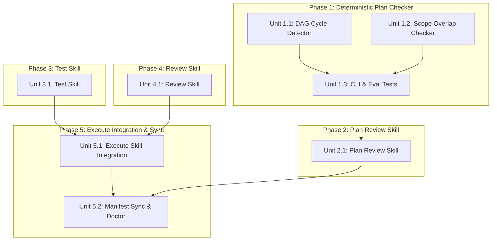

# Unit Lifecycle Primitives: Plan Review, Test-Driven Execution, and Diff Review

## Outcome

Introduce three foundational unit lifecycle skills and a deterministic graph/scope validation tool to Context Factory:
1. `plan-review`: Audits plans cold-start in a fresh session before execution, verifying acyclic graphs, disjoint parallel scopes, cold-start context packets, and acceptance criteria test mapping.
2. `test`: Operationalizes unit verification sections test-first (failing tests first, then implementation), providing concrete patterns for architecture, contract, and migration tests.
3. `review`: Conducts independent white-box diff reviews inside worktrees before developer checkpoints, verifying scope fence adherence, missing tests, SOLID rules, and Definition of Done.
4. Deterministic Plan Checker (`scripts/plan-check.mjs`): Deterministically checks dependency DAGs for cycles and parallel units for file scope collisions.

## Pre-planning record

- **Context Specification:** [[docs/context/skills/unit-execution-review-and-testing-skills|Unit Lifecycle Context Spec]] (`status: ready`)
- **Durable Architecture Decision:** [[docs/decisions/0024-unit-execution-review-and-testing-skills|ADR 0024]] (`status: accepted`)

### Actors and goals

- **Lead Engineers & PMs:** Prevent planning failures (cyclic dependencies and overlapping file scopes) from reaching execution sessions by catching them automatically at plan review.
- **AI Agents / Developers:** Write tests first using established patterns for difficult test types (architecture, contract, migration) rather than skipping them or improvising.
- **Code Reviewers:** Receive pre-screened diffs at batch checkpoints that are guaranteed to stay within declared unit scope fences and comply with SOLID principles.

### Domain language

- **Unit:** A self-contained, atomic task artifact (`unit-*.md`) representing one cohesive seam surfaced by SOLID auditing, containing its own copied-in context packet, declared scope, steps, typed test plan, rollback, and Definition of Done.
- **Ready Batch:** A set of units in the active phase whose dependencies are satisfied and have no dependency edge between each other, making them safely parallelizable.
- **Scope Fence:** The explicit `**In scope:**` file boundaries declared in a unit artifact; any touched file outside this list constitutes a scope violation.
- **Deterministic Plan Checker:** A mathematical graph and set-intersection validator ensuring acyclic DAGs and disjoint parallel scopes without relying on non-deterministic LLM evaluation.

### Scenario coverage

| ID | Actor and situation | Preconditions | Expected outcome | Failure/recovery | Status |
|---|---|---|---|---|---|
| SC-01 | Developer or agent runs `/plan-review` on a plan with cyclic dependencies | Task folder has unit artifacts | Deterministic checker reports cycle path and fails; `plan-review` returns structured remediation instructions | If cycle undetected, surfaces later as deadlocked worktree batch; caught by script | Covered |
| SC-02 | Developer or agent runs `/plan-review` on a plan where two parallel units edit the same file | Units have no dependency edge | Deterministic checker reports file overlap conflict and fails | If undetected, causes worktree merge collisions; caught by script | Covered |
| SC-03 | Executor starts a unit with architecture and migration tests | Unit has Verification section | Executor calls `/test`, which authors failing architecture and migration tests first (Red), then implements (Green) | Superficial mock tests or skipped migrations fail `/review` audit | Covered |
| SC-04 | Executor completes implementation and prepares for batch checkpoint | Worktree has uncommitted or committed unit changes | `/review` audits `git diff` against unit scope fence; flags out-of-scope edits or missing tests before human review | Scope leak caught before developer checkpoint | Covered |

### Decision ledger

| ID | Question | Decision | Evidence or rationale | Alternatives rejected | Artifact |
|---|---|---|---|---|---|
| D-01 | Should diff review be a dedicated skill or an extension of `verify`? | Dedicated `skills/engineering/review/SKILL.md` | Preserves separation of concerns: `review` is white-box intra-worktree diff auditing; `verify` is black-box whole-task acceptance verification. | Rejected dual-mode `verify` extension which muddies the mental model. | [[docs/decisions/0024-unit-execution-review-and-testing-skills|ADR 0024]] |
| D-02 | How should DAG cycles and parallel file scope overlaps be detected? | Deterministic Node.js script (`scripts/plan-check.mjs`) | Topological sorting and set intersection are mathematical algorithms requiring 100% determinism; LLMs frequently hallucinate disjointness. | Rejected pure LLM evaluation of file scopes and graph cycles. | [[docs/decisions/0024-unit-execution-review-and-testing-skills|ADR 0024]] |
| D-03 | How should `test` enforce test-first execution? | Red-Green TDD contract with explicit patterns for architecture, contract, and migration tests | Architecture, contract, and migration tests are the ones agents skip most frequently; dedicated skill guarantees failing assertions first. | Rejected allowing `execute` to improvise tests inline. | [[docs/decisions/0024-unit-execution-review-and-testing-skills|ADR 0024]] |

## Acceptance criteria

| ID | Source goal/scenario/decision | Criterion | Implementation | Verification | Status |
|---|---|---|---|---|---|
| AC-01 | D-02, SC-01, SC-02 | `scripts/plan-check.mjs` deterministically detects cycles in `depends_on` graphs and file overlap between parallel units, exposed via `node scripts/context.mjs plan:check <task-dir>`. | `scripts/plan-check.mjs`, `scripts/harness-cli.mjs` | Automated unit tests in `evals/` passing cycle and overlap test cases. | Planned |
| AC-02 | SC-01, SC-02 | `skills/productivity/plan-review/SKILL.md` audits task plans cold-start, validating deterministic checks, context packet sufficiency, and AC-to-test mapping. | `skills/productivity/plan-review/SKILL.md`, `agents/openai.yaml` | Contract inspection and skill lint passes cleanly. | Planned |
| AC-03 | D-03, SC-03 | `skills/engineering/test/SKILL.md` enforces test-first authoring with explicit patterns for architecture tests, contract tests, and migration forward/rollback tests. | `skills/engineering/test/SKILL.md`, `agents/openai.yaml` | Contract inspection and skill lint passes cleanly. | Planned |
| AC-04 | D-01, SC-04 | `skills/engineering/review/SKILL.md` conducts independent diff reviews checking scope fences, missing tests, SOLID principles, and Definition of Done. | `skills/engineering/review/SKILL.md`, `agents/openai.yaml` | Contract inspection and skill lint passes cleanly. | Planned |
| AC-05 | SC-03, SC-04 | `skills/engineering/execute/SKILL.md` delegates test creation to `test` and diff pre-screening to `review` before batch checkpoints. | `skills/engineering/execute/SKILL.md` | Skill workflow inspection and evaluation suite pass. | Planned |
| AC-06 | Factory health | All new skills, scripts, and orchestrators registered in `context-manifest.json` and verified with `node scripts/context.mjs doctor`. | Manifest, lockfile, symlinks | `node scripts/context.mjs doctor` exits 0 (HEALTHY). | Planned |

## Scope

- Create `scripts/plan-check.mjs` and register CLI command `plan:check` in `scripts/harness-cli.mjs`.
- Author `skills/productivity/plan-review/SKILL.md` and OpenAI agent interface.
- Author `skills/engineering/test/SKILL.md` and OpenAI agent interface.
- Author `skills/engineering/review/SKILL.md` and OpenAI agent interface.
- Update `skills/engineering/execute/SKILL.md` to integrate `test` and `review`.
- Update `skills/productivity/README.md` and `skills/engineering/README.md` group indexes.
- Update orchestrators (`orchestrator/SHARED.md`, `CLAUDE.md`, `AGENTS.md`, `CODEX.md`, `GEMINI.md`).
- Update `context-manifest.json`, generate `.agents` symlinks, update `context-lock.json`, and run doctor.

## Non-goals

- Altering the core prompt/workflow of `grill` or `plan`.
- Introducing external AST parsing libraries or runtime dependencies (Node.js standard library only).
- Replacing the black-box release verification duties of `verify`.

## Dependency Graph & Phases

- **Phase 1 — Deterministic Plan Checker:** [Phase 1 Overview](phase-01-deterministic-plan-checker/phase.md)
  - Unit 1.1: DAG Cycle Detector (`scripts/plan-check.mjs`)
  - Unit 1.2: Scope Overlap Checker (`scripts/plan-check.mjs`) [Parallel with 1.1]
  - Unit 1.3: CLI Harness Integration & Eval Test Cases
- **Phase 2 — Plan Review Skill:** [Phase 2 Overview](phase-02-plan-review-skill/phase.md)
  - Unit 2.1: Author `plan-review` Skill & Agent Interface
- **Phase 3 — Test-First Implementation Skill:** [Phase 3 Overview](phase-03-test-skill/phase.md)
  - Unit 3.1: Author `test` Skill & Agent Interface [Parallel with Phase 1/2]
- **Phase 4 — Unit Diff Review Skill:** [Phase 4 Overview](phase-04-review-skill/phase.md)
  - Unit 4.1: Author `review` Skill & Agent Interface [Parallel with Phase 1/2/3]
- **Phase 5 — Execute Integration & Factory Synchronization:** [Phase 5 Overview](phase-05-execute-integration-and-sync/phase.md)
  - Unit 5.1: Integrate `test` & `review` into `execute` Workflow
  - Unit 5.2: Manifest Sync, Symlinks, Lockfile & Doctor Verification

## Verification

- `node scripts/context.mjs plan:check <task-dir>`: Automated validation of plan DAGs and file scopes.
- `node scripts/context.mjs doctor`: 100% PASS across syntax lint, lockfile integrity, symlinks, and evaluations.
- `npm test`: Full 22+ case test suite passing cleanly.
