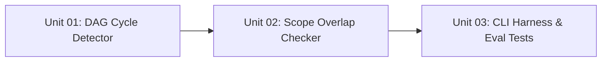

# Phase 1 — Deterministic Plan Checker

## Objective

Build a deterministic Node.js plan checker script (`scripts/plan-check.mjs`) and CLI command (`node scripts/context.mjs plan:check <task-dir>`) that parses unit artifacts, builds the dependency DAG, verifies that the graph is strictly acyclic, and validates that parallel units have completely disjoint declared file scopes.

## Context & Prerequisites

- Context Specification: [[docs/context/skills/unit-execution-review-and-testing-skills|Unit Lifecycle Context Spec]]
- ADR 0024: [[docs/decisions/0024-unit-execution-review-and-testing-skills|ADR 0024]]
- Unit Template Contract: [[docs/templates/Unit|Unit Template]]

## Unit Index & Dependency Graph

| Unit ID | Title | File | Depends On | Parallelizable With | Status |
| :--- | :--- | :--- | :--- | :--- | :--- |
| **Unit 01.01** | DAG Cycle Detector | `unit-01-dag-cycle-detector.md` | `none` | `none` | `verified` |
| **Unit 01.02** | Scope Overlap Checker | `unit-02-scope-overlap-checker.md` | `Unit 01.01` | `none` | `verified` |
| **Unit 01.03** | CLI Harness & Eval Tests | `unit-03-cli-and-eval-tests.md` | `Unit 01.02` | `none` | `verified` |

## Impacted Files & Components

- `scripts/plan-check.mjs` (New deterministic checker module)
- `scripts/harness-cli.mjs` (Expose `plan:check` command)
- `evals/cases/` (Unit test cases for plan checking)

## Rollback Strategy

Delete `scripts/plan-check.mjs` and revert changes to `scripts/harness-cli.mjs`.
