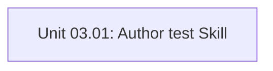

# Phase 3 — Test-First Implementation Skill

## Objective

Author and catalog the `test` skill (`skills/engineering/test/SKILL.md`) and its OpenAI agent interface (`agents/openai.yaml`). The skill enforces a strict test-first (Red-Green-Refactor) protocol for implementing unit verification sections, providing concrete patterns for architecture boundary tests, contract tests, and database migration forward/rollback tests.

## Context & Prerequisites

- Can run in parallel with Phase 1 and Phase 2.
- Skill Group: Engineering (`skills/engineering/`).

## Unit Index & Dependency Graph

| Unit ID | Title | File | Depends On | Parallelizable With | Status |
| :--- | :--- | :--- | :--- | :--- | :--- |
| **Unit 03.01** | Author `test` Skill | `unit-01-test-skill.md` | `none` | `Phase 1, Phase 2, Phase 4` | `verified` |

## Impacted Files & Components

- `skills/engineering/test/SKILL.md` (New skill instructions)
- `skills/engineering/test/agents/openai.yaml` (Agent interface)
- `skills/engineering/README.md` (Group index update)

## Rollback Strategy

Remove `skills/engineering/test/` and revert index.
