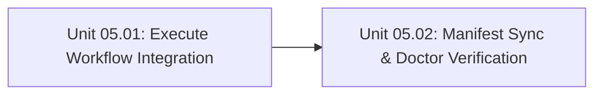

# Phase 5 — Execute Integration & Factory Synchronization

## Objective

Integrate the newly created `test` and `review` skills directly into `skills/engineering/execute/SKILL.md`, synchronize the manifest and lockfile, update all orchestrator contracts, and verify 100% factory health using `doctor` and the test suite.

## Context & Prerequisites

- Requires Phase 2 (`plan-review`), Phase 3 (`test`), and Phase 4 (`review`) completed.

## Unit Index & Dependency Graph

| Unit ID | Title | File | Depends On | Parallelizable With | Status |
| :--- | :--- | :--- | :--- | :--- | :--- |
| **Unit 05.01** | Execute Workflow Integration | `unit-01-execute-workflow-integration.md` | `Phase 3, Phase 4` | `none` | `completed` |
| **Unit 05.02** | Manifest Sync & Doctor Verification | `unit-02-manifest-sync-and-doctor.md` | `Unit 05.01, Phase 2` | `none` | `completed` |

## Impacted Files & Components

- `skills/engineering/execute/SKILL.md` (Update execution workflow to invoke `test` and `review`)
- `orchestrator/SHARED.md`, `CLAUDE.md`, `AGENTS.md`, `CODEX.md`, `GEMINI.md`
- `context-manifest.json`, `context-lock.json`
- `.agents/skills/` symlinks

## Rollback Strategy

Revert changes to `execute/SKILL.md`, orchestrator files, manifest, and lockfile.
