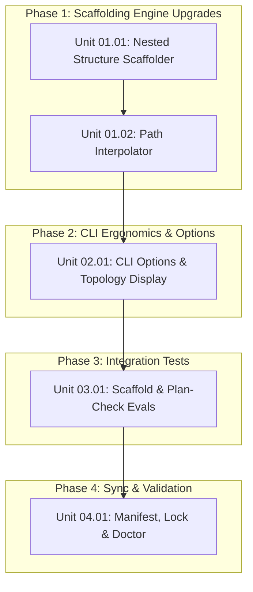

# Worktree-Aware Unit Scaffolding in CLI Task Harness

## Outcome

Enhance the Context Factory task scaffolding harness (`node scripts/context.mjs task:new "<title>"`) so that it automatically scaffolds nested phase directory structures (`phase-01-<slug>/phase.md`) and pre-populates initial worktree-aware unit artifacts (`unit-01-<slug>.md`) using `docs/templates/Unit.md`. The scaffolded task will out-of-the-box contain deterministic branch names, worktree directories, and pass `node scripts/context.mjs plan:check <task-dir>` without manual boilerplate assembly.

## Pre-planning record

### Actors and goals

- **Lead Engineers / PM Agent (`agents/pm-agent`):** Run `task:new "<title>"` and instantly receive a fully structured, worktree-compliant task hierarchy with zero manual copying of unit templates.
- **Developers / Execution Sessions (`skills/engineering/execute`):** Find pre-assigned worktree paths (`.worktrees/0002/phase-01/...`) and branch names (`task/0002/phase-01/...`) ready for immediate cold-start execution.
- **Plan Reviewers (`skills/productivity/plan-review`):** Run `node scripts/context.mjs plan:check <task-dir>` on freshly scaffolded tasks and receive an immediate clean PASS on DAG structure and disjoint file scopes.

### Domain language

- **Task Base Branch:** The integration baseline branch for the task (`task/<id>-<slug>`).
- **Phase Integration Branch:** The aggregation branch for a specific phase (`task/<id>/phase-<num>`).
- **Unit Branch:** The dedicated working branch for an atomic unit (`task/<id>/phase-<num>/<unit-slug>`).
- **Worktree Directory:** The dedicated physical working directory (`.worktrees/<id>/phase-<num>/<unit-slug>/`).
- **Task Scaffolder:** `scripts/task-workflow.mjs`, which orchestrates templating and file system creation for new tasks.

### Scenario coverage

| ID | Actor and situation | Preconditions | Expected outcome | Failure/recovery | Status |
| --- | --- | --- | --- | --- | --- |
| SC-01 | Developer runs `context-cli task new "add auth"` | Valid task title provided | Scaffolds `phase-01-<slug>/phase.md` and `unit-01-<slug>.md` with pre-filled branch & worktree paths | If template read fails, returns descriptive CLI error | Planned |
| SC-02 | Developer runs `context-cli plan:check` immediately after `task:new` | Task scaffolded with new engine | Deterministic plan checker reports PASS: 4 units found (1 per default phase), acyclic graph, disjoint scopes | If any unit omitted, fails plan check; caught in evals | Planned |
| SC-03 | Developer specifies `--no-units` flag | Developer wants empty phase outlines | Scaffolds only `phase.md` files without unit files | Handled gracefully via CLI flags | Planned |
| SC-04 | Developer inspects `README.md` and `phase.md` | Task scaffolded | `Worktree & Branch Topology` table in `README.md` and `Unit Index` in `phase.md` are pre-populated | Checked via automated regex inspection | Planned |

### Decision ledger

| ID | Question | Decision | Evidence or rationale | Alternatives rejected | Artifact |
| --- | --- | --- | --- | --- | --- |
| D-01 | Should phases be flat files (`phase-01.md`) or directories (`phase-01/phase.md`)? | Nested directories (`phase-01-<slug>/phase.md`) | Required by unit execution architecture: units live inside phase directories (`phase-01/unit-01.md`). Flat files broke directory encapsulation. | Flat phase files with root units. | Task README |
| D-02 | How many units should `task:new` scaffold by default? | Exactly 1 initial starter unit per phase (`unit-01-<slug>.md`) | Guarantees that freshly scaffolded tasks are immediately syntactically valid under `plan:check` while providing clear placeholders for elaboration. | 0 units (which fails `plan:check`) or arbitrary hardcoded unit counts. | Task README |
| D-03 | How should branch and worktree paths be derived? | Deterministically from `taskId`, `phaseNumber`, `phaseSlug`, and `unitSlug` | Ensures 100% adherence to the 3-tier hierarchy established in `skills/productivity/plan/SKILL.md`. | Free-form user inputs or manual entry. | Task README |

### Unknowns and blockers

- None. Node.js `fs/promises` and existing template files provide all required primitives.

## Acceptance criteria

| ID | Source goal/scenario/decision | Criterion | Implementation | Verification | Status |
| --- | --- | --- | --- | --- | --- |
| AC-01 | D-01, SC-01 | `scripts/task-workflow.mjs` scaffolds phases as directories (`phase-<num>-<slug>/phase.md`) containing starter units (`unit-01-<slug>.md`). | `scripts/task-workflow.mjs` | Unit test in `evals/task-scaffold.test.mjs` verifying directory structure. | Planned |
| AC-02 | D-03, SC-01, SC-04 | Scaffolded `README.md`, `phase.md`, and `unit-*.md` have `branch` and `worktree` fields pre-populated with deterministic paths matching the 3-tier taxonomy. | `scripts/task-workflow.mjs` | Automated assertion in `evals/task-scaffold.test.mjs`. | Planned |
| AC-03 | SC-02, D-02 | A newly scaffolded task folder passes `node scripts/context.mjs plan:check <task-dir>` with 0 findings out-of-the-box. | `scripts/task-workflow.mjs`, `scripts/plan-check.mjs` | `node scripts/context.mjs plan:check <new-task-dir>` exits 0. | Planned |
| AC-04 | SC-03 | CLI flags `--no-units` and `--dry-run` operate reliably in `app/cli/commands/task.mjs`. | `app/cli/commands/task.mjs` | CLI invocation assertions in `evals/task-scaffold.test.mjs`. | Planned |
| AC-05 | Factory health | All test suites pass, manifest and lockfile are synchronized, and `doctor` reports 100% HEALTHY. | Manifest, lock, symlinks | `node scripts/context.mjs doctor` exits 0. | Planned |

## Scope

- Update `scripts/task-workflow.mjs` (`scaffoldTask`) to create nested phase folders and render `docs/templates/Unit.md`.
- Interpolate all `{{task_id}}`, `{{task_slug}}`, `{{parent_task}}`, `{{parent_phase}}`, `{{phase_number}}`, `{{unit_id}}`, `branch`, and `worktree` tokens across templates.
- Update `app/cli/commands/task.mjs` to format output showing the generated worktree topology and support `--no-units`.
- Add integration test suite `evals/task-scaffold.test.mjs`.
- Sync manifest, lockfile, and verify with `doctor`.

## Non-goals

- Altering the mathematical logic in `scripts/plan-check.mjs`.
- Modifying how `git worktree add` creates directories at runtime (handled by `scripts/worktree.mjs` and `execute`).
- Auto-generating production code implementation.

## Worktree & Branch Topology

| Phase | Unit ID | Unit Title | Branch Name | Worktree Directory | Merge Target | Status |
| --- | --- | --- | --- | --- | --- | --- |
| phase-01 | 01.01 | Nested Phase & Unit Folder Scaffolder | `task/0002/phase-01/unit-01-nested-structure` | `.worktrees/0002/phase-01/unit-01-nested-structure` | `task/0002/phase-01/integration` | completed |
| phase-01 | 01.02 | Branch & Worktree Path Interpolator | `task/0002/phase-01/unit-02-path-interpolator` | `.worktrees/0002/phase-01/unit-02-path-interpolator` | `task/0002/phase-01/integration` | completed |
| phase-02 | 02.01 | CLI Options & Topology Display | `task/0002/phase-02/unit-01-cli-options` | `.worktrees/0002/phase-02/unit-01-cli-options` | `task/0002/phase-02/integration` | completed |
| phase-03 | 03.01 | Scaffold & Plan-Check Integration Evals | `task/0002/phase-03/unit-01-scaffold-evals` | `.worktrees/0002/phase-03/unit-01-scaffold-evals` | `task/0002/phase-03/integration` | completed |
| phase-04 | 04.01 | Manifest, Lock & Doctor Validation | `task/0002/phase-04/unit-01-sync-and-doctor` | `.worktrees/0002/phase-04/unit-01-sync-and-doctor` | `task/0002/phase-04/integration` | completed |

## Dependency Graph & Phases

- [x] `phase-01-scaffolding-engine/phase.md` — Phase 1: Scaffolding Engine Upgrades
- [x] `phase-02-cli-ergonomics/phase.md` — Phase 2: CLI Ergonomics & Options
- [x] `phase-03-integration-tests/phase.md` — Phase 3: Integration Tests
- [x] `phase-04-sync-and-doctor/phase.md` — Phase 4: Factory Synchronization & Doctor

## Verification

- `node scripts/context.mjs plan:check docs/tasks/2026/09/2026-09-28/0002-task-worktree-aware-unit-scaffolding`: Validate plan structure.
- `node --test tests/task-scaffold.test.mjs`: Test scaffolding engine, options, and interpolation (4/4 passed).
- `node --test evals/task-scaffold.test.mjs`: End-to-end task scaffolding and plan-check integration suite (3/3 passed).
- `npm test`: Full 22-case evaluation suite (22/22 passed).
- `node scripts/context.mjs doctor`: 100% HEALTHY check across manifest, lockfile, symlinks, and evals.

## Deviations

None. All 5 units executed within dedicated git worktrees and isolated branches following the 3-tier hierarchy.

## Finalization & Merge Ledger

| Stage | Source Branch | Target Branch | Merge Commit SHA | Worktree Cleaned | Verification Command |
| --- | --- | --- | --- | --- | --- |
| Phase 01 Integration | `task/0002/phase-01/integration` | `task/0002-worktree-aware-unit-scaffolding` | `305f390` | [x] | `npm test && node --test tests/task-scaffold.test.mjs` |
| Phase 02 Integration | `task/0002/phase-02/integration` | `task/0002-worktree-aware-unit-scaffolding` | `701a301` | [x] | `node --test tests/task-scaffold.test.mjs` |
| Phase 03 Integration | `task/0002/phase-03/integration` | `task/0002-worktree-aware-unit-scaffolding` | `2b3edcb` | [x] | `node --test evals/task-scaffold.test.mjs` |
| Phase 04 Integration | `task/0002/phase-04/integration` | `task/0002-worktree-aware-unit-scaffolding` | `ee3bbc4` | [x] | `node scripts/context.mjs doctor` |
| Task Finalization | `task/0002-worktree-aware-unit-scaffolding` | `master` | `b34d951` | [x] | `node scripts/context.mjs doctor` |

## Result

Task 0002 completed and fully verified.
The task generator (`node scripts/context.mjs task:new`) now scaffolds nested phase directories (`phase-NN-<slug>/phase.md`), interpolates worktree-aware starter units (`unit-01-<slug>.md`) from `docs/templates/Unit.md`, renders the Worktree & Branch Topology in the terminal and in JSON output, and all newly scaffolded tasks pass `plan:check` with 0 findings out-of-the-box. All worktrees were pruned and cleaned with zero leftover artifacts.
