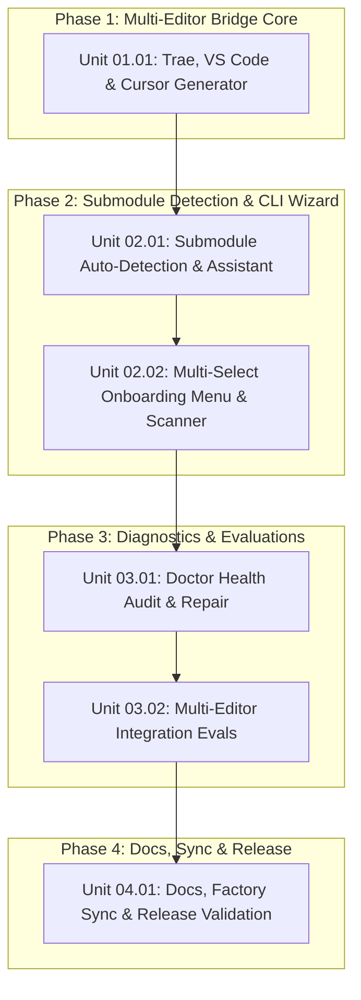

# Submodule-First Flow and Multi-Editor Bridging

## Outcome

Establish a seamless, unified 3-step onboarding workflow for host projects adopting Context Factory:

1. **Git Submodule:** Add Context Factory as a submodule (defaults to `.context-factory` with hybrid auto-detection in CLI).
2. **Launch Wizard:** Run `context-cli init` (or `node .context-factory/app/cli/bin/context-cli.mjs init`) with smart parent/submodule detection.
3. **Multi-Editor Bridging:** Select from `[VS Code, Antigravity, Cursor, Trae, All]` with smart folder detection, multi-select support, and non-destructive configuration bridging.

## Pre-planning record

### Actors and goals

- **Host Repository Developers:** Effortlessly integrate Context Factory rules and skills into their projects using their preferred editor (VS Code, Antigravity, Cursor, or Trae) with zero manual path calculations.
- **Cross-Functional Engineering Teams:** Seamlessly work together in the same repository across mixed editors without conflicting configuration or drift.
- **Context Factory Maintainers:** Guarantee that bridged artifacts stay healthy, auto-healing, and easily verifiable through `context-cli doctor`.

### Domain language

- **Host Repository:** The consumer application repository that embeds Context Factory.
- **Submodule Path:** The directory where Context Factory is embedded (defaults to `.context-factory`).
- **Bridge Artifacts:** Editor-specific configuration files (`.agents/`, `.trae/rules/`, `.cursor/rules/`, `.vscode/`, `AGENTS.md`, `GEMINI.md`).
- **Hybrid Assistant:** CLI capability that auto-detects existing submodules or guides the user through `git submodule add`.
- **Smart Directory Detection:** Detecting whether the CLI is executed from within the submodule or from the host root to resolve relative paths cleanly.

### Scenario coverage

| ID | Actor and situation | Preconditions | Expected outcome | Failure/recovery | Status |
| --- | --- | --- | --- | --- | --- |
| SC-01 | Developer runs `context-cli init` in a Git repository without submodule | Git initialized in project | CLI detects Git repo, offers to run `git submodule add` into `.context-factory` or prints exact command | If git fails, falls back gracefully to local linking | planned |
| SC-02 | Developer runs `context-cli init` from inside `./.context-factory` | Submodule cloned | CLI recognizes execution from within submodule, sets target to `..`, and computes relative symlinks accurately | Prompts if parent cannot be determined | planned |
| SC-03 | Host project has existing `.vscode/settings.json` | Existing user settings present | Safe JSON merge adds context-factory properties without clobbering existing settings | If JSON invalid, creates `.vscode/settings.context-factory.json` with warning | planned |
| SC-04 | Developer chooses multiple editors (`1, 4` for VS Code + Trae) | Interactive menu | Generates `.github/copilot-instructions.md`, `.vscode/`, `.trae/rules/project_rules.md`, and `AGENTS.md` | Table reports status of all created/updated artifacts | planned |
| SC-05 | Developer runs `context-cli doctor` on bridged host repo | Host repo bridged | Verifies health of Trae rules, VS Code copilot/settings, Cursor rules, and Antigravity symlinks | Reports clear status and supports `--repair` | planned |

### Decision ledger

| ID | Question | Decision | Evidence or rationale | Alternatives rejected | Artifact |
| --- | --- | --- | --- | --- | --- |
| D-01 | What is the default submodule directory name? | `.context-factory` | Keeps host project root clean while allowing custom paths. | Visible `context-factory` as only option. | ADR 0026 |
| D-02 | How should the CLI assist with git submodule creation? | Hybrid assistant | Auto-detects if already added; if missing, offers to run `git submodule add` or prints exact instructions. | Requiring purely manual git commands beforehand. | ADR 0026 |
| D-03 | How should editor selection behave? | Multi-select with smart detection | Scans for `.vscode/`, `.cursor/`, `.trae/`, `.agents/`, pre-selects detected environments, and allows comma-separated multi-selection. | Single-editor only selection. | ADR 0026 |
| D-04 | How should Trae IDE be bridged? | `.trae/rules/project_rules.md` | Trae project rules directory standard for repository-level AI guidelines. | Global user rules only. | ADR 0026 |
| D-05 | How should VS Code be bridged? | `.github/copilot-instructions.md` + safe `.vscode/` merge | Covers GitHub Copilot, workspace settings, and recommended extensions non-destructively. | Overwriting existing `.vscode/settings.json`. | ADR 0026 |
| D-06 | How should modern Cursor rules be handled? | `.cursor/rules/context-factory.mdc` + `.cursorrules` | Supports modern Cursor `.mdc` format while retaining legacy root compatibility. | Legacy `.cursorrules` only. | ADR 0026 |

### Unknowns and blockers

- None. Node.js built-in `fs/promises`, `child_process`, and existing CLI architecture provide all necessary primitives.

## Acceptance criteria

| ID | Source goal/scenario/decision | Criterion | Implementation | Verification | Status |
| --- | --- | --- | --- | --- | --- |
| AC-01 | D-04, D-05, D-06 | `generateBridge` supports `trae`, `vscode`, and modern `cursor` (.mdc), generating `.trae/rules/project_rules.md`, `.github/copilot-instructions.md`, `.vscode/extensions.json`, and `.cursor/rules/context-factory.mdc`. | `app/cli/core/bridge-generator.mjs` | Automated test asserting file creation and content | planned |
| AC-02 | D-05, SC-03 | Existing `.vscode/settings.json` is merged safely without clobbering pre-existing user configuration keys. | `app/cli/core/bridge-generator.mjs` | Unit test verifying deep JSON property merge | planned |
| AC-03 | D-01, D-02, SC-01, SC-02 | `init.mjs` auto-detects execution from within `.context-factory` submodule (targeting `..`) and offers hybrid git submodule assistant when run in an un-submoduled repo. | `app/cli/commands/init.mjs` | Unit test simulating submodule path resolution | planned |
| AC-04 | D-03, SC-04 | Interactive onboarding wizard displays numbered menu `[1] VS Code, [2] Antigravity, [3] Cursor, [4] Trae, [5] All IDEs`, detects existing editor folders, and accepts comma-separated multi-select choices. | `app/cli/commands/init.mjs` | TTY prompt test with single and multi-selection | planned |
| AC-05 | SC-05 | `context-cli doctor` audits Trae, VS Code, Cursor, and Antigravity bridge files and repairs missing artifacts when run with `--repair`. | `app/cli/commands/doctor.mjs` | Test verifying doctor output and repair execution | planned |
| AC-06 | Documentation & Sync | `app/cli/README.md`, `README.md`, and integration guides document the 3-step onboarding flow; manifest and lockfile pass `context-cli doctor` 100% HEALTHY. | Documentation, manifest, lock | `node scripts/context.mjs doctor` exits 0 | planned |

## Scope

- Extend `bridge-generator.mjs` with generators for Trae, VS Code, and modern Cursor `.mdc` rules.
- Implement safe non-destructive JSON merge helper for `.vscode/settings.json`.
- Add submodule detection and hybrid assistant prompt to `init.mjs`.
- Add smart editor folder detection and numbered multi-select prompt to `init.mjs`.
- Update `bridge.mjs` command flags, aliases, and output formatting.
- Extend `doctor.mjs` and `verifySymlinkHealth` to audit all 4 editor configurations.
- Add evaluation test cases for multi-editor bridging and safe merging.
- Update documentation and synchronize Context Factory inventory.

## Non-goals

- Building binary editor extensions or marketplace plugins.
- Modifying internal rules or skills content.
- Managing git remotes or credentials beyond running standard `git submodule add`.

## Worktree & Branch Topology

| Phase | Unit ID | Unit Title | Branch Name | Worktree Directory | Merge Target | Status |
| --- | --- | --- | --- | --- | --- | --- |
| phase-01 | 01.01 | Trae, VS Code, and Cursor Generator Enhancements | `task/0001/phase-01/unit-01-bridge-core` | `.worktrees/0001/phase-01/unit-01-bridge-core` | `task/0001/phase-01/integration` | planned |
| phase-02 | 02.01 | Submodule Environment Auto-Detection and Hybrid Assistant | `task/0001/phase-02/unit-01-submodule-detection` | `.worktrees/0001/phase-02/unit-01-submodule-detection` | `task/0001/phase-02/integration` | planned |
| phase-02 | 02.02 | Installed IDE Folder Scanner & Numbered Multi-Select Onboarding Menu | `task/0001/phase-02/unit-02-editor-wizard` | `.worktrees/0001/phase-02/unit-02-editor-wizard` | `task/0001/phase-02/integration` | planned |
| phase-03 | 03.01 | Doctor Health Audit & Auto-Repair for All Editors | `task/0001/phase-03/unit-01-doctor-audit-repair` | `.worktrees/0001/phase-03/unit-01-doctor-audit-repair` | `task/0001/phase-03/integration` | planned |
| phase-03 | 03.02 | Automated Integration Evaluations for Multi-Editor Bridging | `task/0001/phase-03/unit-02-integration-evals` | `.worktrees/0001/phase-03/unit-02-integration-evals` | `task/0001/phase-03/integration` | planned |
| phase-04 | 04.01 | Documentation, Factory Sync & Doctor Validation | `task/0001/phase-04/unit-01-docs-sync-release` | `.worktrees/0001/phase-04/unit-01-docs-sync-release` | `task/0001/phase-04/integration` | planned |

## Dependency Graph & Phases

## Phases

- [ ] `phase-01-multi-editor-bridge-core/phase.md` — Phase 1: Multi-Editor Bridge Core
- [ ] `phase-02-submodule-detection-and-cli-wizard/phase.md` — Phase 2: Submodule Detection & CLI Wizard
- [ ] `phase-03-diagnostics-and-evaluations/phase.md` — Phase 3: Diagnostics & Evaluations
- [ ] `phase-04-docs-sync-and-release/phase.md` — Phase 4: Docs, Sync & Release

## Verification

- `node scripts/context.mjs plan:check docs/tasks/2026/10/2026-10-05/0001-task-submodule-first-flow-and-multi-editor-bridging`: Validate acyclic DAG and disjoint scopes.
- `node --test tests/bridge-generator.test.mjs`: Test generation of Trae, VS Code, Cursor, and Antigravity files.
- `node app/cli/bin/context-cli.mjs doctor`: Multi-point health check across symlinks, lockfile, manifest, and evals.
- `npm test`: Full Context Factory evaluation suite.

## Deviations

None.

## Finalization & Merge Ledger

| Stage | Source Branch | Target Branch | Merge Commit SHA | Worktree Cleaned | Verification Command |
| --- | --- | --- | --- | --- | --- |
| Phase 01 Integration | `task/0001/phase-01/integration` | `task/0001-submodule-first-flow-and-multi-editor-bridging` | pending | [ ] | `node --test tests/bridge-generator.test.mjs` |
| Phase 02 Integration | `task/0001/phase-02/integration` | `task/0001-submodule-first-flow-and-multi-editor-bridging` | pending | [ ] | `node app/cli/bin/context-cli.mjs init --dry-run` |
| Phase 03 Integration | `task/0001/phase-03/integration` | `task/0001-submodule-first-flow-and-multi-editor-bridging` | pending | [ ] | `npm test` |
| Phase 04 Integration | `task/0001/phase-04/integration` | `task/0001-submodule-first-flow-and-multi-editor-bridging` | pending | [ ] | `node scripts/context.mjs doctor` |
| Task Base Finalization | `task/0001-submodule-first-flow-and-multi-editor-bridging` | `master` | pending | [ ] | `node scripts/context.mjs doctor` |

## Result

Pending execution.
