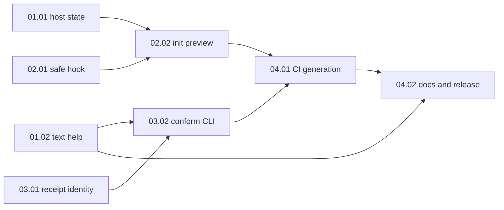

# Task-focused submodule CLI UX

## Outcome

After adding Context Factory as a submodule, a developer can preview and apply only the intended host/editor integration, opt into local hook and GitHub Actions gates separately, and see a compact, accessible next action. A selected CI gate runs conformance in its checkout and accepts only a persisted, current `PASS` report tied to the active binding and changed content. This plan creates no production code and requires plan review plus explicit approval before execution.

## Pre-planning record

- Released handoff: `docs/discovery/submodule-first-developer-cli-ux/brief.md`, SHA-256 `5996f11013d3359dbaa04102b0801f7480611fc22a8bb7d8283709ddb49af320`; machine verification passed on 2026-10-07.
- Source context: `docs/context/cli/submodule-first-developer-cli-ux.md`, status `ready`, normalized hash `bbe6a00dfab707084ecf8448ab723dc771892306bd4a6fc646adedc40e408087`.
- Decisions: ADR 0026 submodule onboarding; ADR 0029 authoritative conformance; ADR 0032 task-focused facade, mascot removal, opt-in gates, and strict CI. ADR 0031 governs the reviewed handoff and conditional worktree policy.
- Grounding: Wiki packet G-CLI-001 found no applicable canonical CLI knowledge item. Source and accepted ADRs provide the behavior evidence.

### Actors and goals

Host developer: setup with explicit editor/gate choices. Maintainer: see host readiness, conflicts, and valid human-evidence requirements. CI author: use stable non-interactive commands and fail-closed reports.

### Domain language

Use host project, factory submodule, editor bridge, rule binding, conformance report, and optional gate as in the released brief and ADRs. No new glossary term is introduced.

### Language stack and applicable rules

Native Node.js ESM with zero new runtime dependencies. The rule subset for each unit appears in its `<language_rules>` block with whole-file source hashes. These are planning references, **not** an execution Rule Binding receipt. Compile a scoped `preflight` binding in the execution checkout after the final file scope is known. Applicable language rules supersede contradictory plan steps.

### Current-state evidence

| Source | Verified observation | Planning consequence |
| --- | --- | --- |
| `app/cli/bin/context-cli.mjs`, `app/cli/core/formatter.mjs` | Mascot-heavy, wide default help; `preflight` and `conform` dispatch but are absent from command catalog. | Separate presentation work from host/status policy. |
| `app/cli/commands/init.mjs`, `app/cli/commands/bridge.mjs`, `app/cli/core/bridge-generator.mjs` | `init` asks multiple setup questions and falls back to all IDEs in non-interactive mode; bridge generator owns host files. | Add explicit selection and preview at the host-write boundary. |
| `app/cli/commands/status.mjs`, `app/cli/commands/doctor.mjs` | Status is factory inventory; doctor runs broad checks. | Model host setup, factory health, and conformance as distinct states. |
| `app/cli/commands/hook.mjs` | Hook install writes `pre-commit` without a conflict check. | Add an atomic, opt-in, non-clobbering hook path. |
| `app/cli/commands/conform.mjs`, `orchestrator/conformance/conformance-orchestrator.mjs`, `.gitignore` | Default report is local/ignored, write failure is swallowed, and default `diffHash` covers path names only. | Add a verifiable content identity and strict persistence before CI generation. |
| `schemas/conformance-report.schema.json`; `.github/workflows/context-factory.yml` | Existing schema has binding/diff hashes; factory workflow runs doctor, not a host conformance gate. | Version receipt identity compatibly and generate a separate host workflow. |

### Scenario coverage

Fresh setup, repeated setup, no editor, missing submodule, existing hook/workflow, unsupported CI provider, narrow/non-TTY output, same-path content edits, unavailable tools, missing human evidence, concurrent setup, and no-code changes are covered by AC-01 through AC-10 and the unit tests below.

### Decision ledger

| ID | Decision | Reason and tradeoff | Source |
| --- | --- | --- | --- |
| D-01 | Keep existing command core and add task-focused facade; remove mascot from CLI output. | Smaller compatibility surface than a TUI. | ADR 0032 |
| D-02 | Separate hook and GitHub Actions opt-ins; never overwrite unrelated host files. | Safer repeated setup; conflicts need recovery text. | ADR 0032, brief |
| D-03 | CI runs conformance on checked-out changes and verifies the new report. | Avoids transporting ignored local receipts; CI must have required tools/evidence. | User Q-01, brief |
| D-04 | Add an explicit identity algorithm marker to the report contract and require it in strict verification; preserve legacy report reads but reject them for CI. | Path-only hashes are insufficient; additive schema permits migration. | ADR 0032, current source |
| D-05 | Keep one task base branch. Use isolated unit branches/worktrees only for recorded parallel slices; integrate through phase branches. | Current checkout is dirty and parallel slices are disjoint. | ADR 0031, checkout audit |

## Unknowns and blockers

None for planning. Before execution, preserve the unrelated dirty checkout, commit/bring the approved context, ADR, discovery, and plan artifacts into the task base, recheck the brief fingerprint and Git state, and obtain an approved review packet. Human evidence for evidence-blocking directives must come from a named human or governed waiver; absence is a `BLOCKED` result, not a planning exception.

## Acceptance criteria

| ID | Source goal/scenario | Criterion | Unit | Verification | Status |
| --- | --- | --- | --- | --- | --- |
| AC-01 | Brief fresh setup | `init` detects host, previews exact selected writes, and gives one next command. | 02.02 | `node --test evals/tests/cli/init-preview.test.mjs` | planned |
| AC-02 | Brief repeat/conflict/concurrency | Re-run is idempotent; unrelated hooks/workflows and raced targets are preserved with clear recovery. | 02.01, 02.02, 04.01 | `node --test evals/tests/cli/hook-safety.test.mjs evals/tests/cli/init-preview.test.mjs evals/tests/cli/github-gate.test.mjs` | planned |
| AC-03 | Brief no editor | Interactive no-detection prompts; automation requires `--ide`; `--ide all` is explicit. | 02.02 | `node --test evals/tests/cli/init-preview.test.mjs` | planned |
| AC-04 | Brief missing submodule/provider | Missing checkout gets exact recovery; unsupported CI gets commands without installed status. | 01.01, 04.01 | `node --test evals/tests/cli/host-status.test.mjs evals/tests/cli/github-gate.test.mjs` | planned |
| AC-05 | Brief accessible display | Default help has no mascot, exposes quality journey, and works with narrow, `NO_COLOR`, non-TTY, and JSON. | 01.02 | `node --test evals/tests/cli/help-output.test.mjs` | planned |
| AC-06 | Brief distinct states | Host, factory, and code conformance have separate actionable states and reasons. | 01.01 | `node --test evals/tests/cli/host-status.test.mjs` | planned |
| AC-07 | Brief strict CI | Generated GitHub workflow initializes submodule, checks health, runs conformance, persists and verifies its report. | 03.01, 03.02, 04.01 | `node --test evals/tests/conformance/receipt-identity.test.mjs evals/tests/conformance/conformance-cli.test.mjs evals/tests/cli/github-gate.test.mjs` | planned |
| AC-08 | Brief stale/failure | Missing, `FAIL`, `BLOCKED`, unavailable, stale binding, and same-path content edits fail; doctor alone cannot pass. | 03.01, 03.02, 04.01 | `node --test evals/tests/conformance/receipt-identity.test.mjs evals/tests/cli/github-gate.test.mjs` | planned |
| AC-09 | Brief authority | CI never fabricates human evidence or waiver; absent required evidence blocks. | 03.02, 04.01 | `node --test evals/tests/conformance/conformance-cli.test.mjs evals/tests/cli/github-gate.test.mjs` | planned |
| AC-10 | Brief host lint/test | Host checks run only when explicitly configured and are labeled unconfigured otherwise. | 04.01, 04.02 | `node --test evals/tests/cli/github-gate.test.mjs` and documentation review | planned |

## Scope

CLI help/status; host detection and setup preview; editor selection; safe local hook; versioned content-bound conformance receipt/verifier; strict GitHub Actions generator; targeted tests; command, migration, and host integration docs.

## Non-goals

Full-screen TUI, new rule engine, new runtime dependency, generated GitLab/other provider files, automatic human approval, weakening conformance policy, unrelated session CLI changes, and production deployment.

## Architecture and SOLID audit

| Principle / boundary | Plan consequence | Check |
| --- | --- | --- |
| SRP | Host-state probes, text formatting, setup mutation, hook mutation, receipt identity, and CI generation have separate owners. | Unit scope review and focused tests. |
| OCP / ISP | CI generator consumes a small verified receipt/check contract; editor bridge and status do not embed alternate conformance policy. | Contract tests for generated commands and existing adapter parity. |
| LSP | Existing command aliases and explicit flags retain behavior; old report reads remain possible though strict CI requires the new identity marker. | CLI contract tests and migration note. |
| DIP | Presentation and workflow generation depend on host/receipt results; `orchestrator/conformance` remains the authority for verdict and waiver policy. | Manual import/dependency review in 01.01, 03.01, 04.01. |

## Dependency graph

No edge connects 01.01 with 01.02, or 02.01 with 03.01: those are logical parallel candidates with disjoint scopes and separate unit worktrees. Unit branches integrate in numeric order within each phase; phase integration follows the dependency graph. Concurrent agents, if later authorized, must use the allocated separate worktrees.

## Risk and dependency register

| Risk or dependency | Impact | Mitigation or owner |
| --- | --- | --- |
| Dirty master checkout contains unrelated edits and untracked discovery/ADR files. | Worktree from HEAD alone misses approved context. | Execution owner records exact baseline, imports only approved artifacts to task base, preserves user files, and rechecks Git state before work. |
| Current path-only report hash and swallowed writes. | False CI pass or missing artifact. | 03.01/03.02 precede workflow generation; strict verifier rejects legacy identity. |
| Evidence-blocking directives. | CI may remain `BLOCKED`. | Require explicit named human input or governed waiver; no automated claim of human review. |
| Generated host workflow and hooks touch user-owned paths. | Clobber or race. | Preview, exclusive create/recheck, per-file conflict state, opt-in. |
| CLI output/JSON consumers. | Breaking scripts. | Preserve explicit commands and status codes or document versioned migration; contract tests. |
| Submodule CI checkout. | Missing factory files. | Checkout with submodules initialized; negative test for missing submodule. |

## Worktree & Branch Topology

| Role | Branch | Checkout path | Purpose |
| --- | --- | --- | --- |
| Target | `master` | current checkout | Receives final reviewed task only. |
| Task base | `feat/PLN-0004-task-focused-submodule-cli-ux` | `.worktrees/PLN-0004/task-base` | Approved artifacts and integrated phase results. |
| Phase 01 | `task/PLN-0004/phase-01-integration` | `.worktrees/PLN-0004/phase-01-integration` | Integrate 01.01 then 01.02. |
| Phase 02 | `task/PLN-0004/phase-02-integration` | `.worktrees/PLN-0004/phase-02-integration` | Integrate 02.01 then 02.02. |
| Phase 03 | `task/PLN-0004/phase-03-integration` | `.worktrees/PLN-0004/phase-03-integration` | Integrate 03.01 then 03.02. |
| Phase 04 | `task/PLN-0004/phase-04-integration` | `.worktrees/PLN-0004/phase-04-integration` | Integrate 04.01 then 04.02. |
| Unit worktrees | `task/PLN-0004/pXX-<unit-slug>` | `.worktrees/PLN-0004/phase-XX/<unit-slug>` | Exact branch/path pairs are declared in each unit; no shared checkout for parallel work. |

This topology is an execution allocation, not a claim that branches/worktrees have been created. If execution is serial, use the task worktree and one branch per ADR 0031; unit branch paths remain reserved for justified parallel handoffs. Avoid Git ref prefix collisions by using `phase-XX-integration` rather than nesting under a `phase-XX` ref.

## Phases

- [ ] [Phase 01 — Host interface](phase-01-host-interface/phase.md): host readiness/status and compact text help (01.01, 01.02).
- [ ] [Phase 02 — Safe setup](phase-02-safe-setup/phase.md): non-clobbering hook and explicit `init` preview (02.01, 02.02).
- [ ] [Phase 03 — Conformance receipts](phase-03-conformance-receipts/phase.md): content identity/verifier and CLI persistence (03.01, 03.02).
- [ ] [Phase 04 — CI integration and release](phase-04-ci-integration-and-release/phase.md): GitHub workflow opt-in and documentation/full verification (04.01, 04.02).

## Verification

Planning: `node scripts/harness-cli.mjs handoff:verify-brief docs/discovery/submodule-first-developer-cli-ux/brief.md`; `node scripts/context.mjs plan:check <task-dir> --json`; `git diff --check`. Execution: focused tests per unit, `node evals/run-evals.mjs`, `node scripts/context.mjs doctor`, `node app/cli/bin/context-cli.mjs lock --check --json`, and final-diff `context-cli conform` with a real `PASS` receipt and named human evidence where required. Report actual IDs, hashes, exit codes, and skipped checks in the execution ledger. Planning checks do not prove implementation.

## Deviations

The task scaffold created a sibling master file and generic phase names. This plan places the master at the requested task-folder `README.md` and names phases by implementation boundary. The later per-unit branch wording in the plan skill conflicts with its own task-branch default and ADR 0031; this plan uses conditional unit branches/worktrees only for justified parallel work.

## Plan done-check

- [x] Acceptance criteria map to units and concrete verification commands.
- [x] No material planning blocker remains; execution prerequisites are explicit.
- [x] Risks, dependencies, and compatibility are recorded.
- [x] Worktree checkout is justified by the dirty current checkout.

## Finalization & Merge Ledger

| Stage | Source Branch | Target Branch | Merge Commit SHA | Worktree Cleaned | Conformance Report | Verification Command |
| --- | --- | --- | --- | --- | --- | --- |
| Phase 01 integration | `task/PLN-0004/phase-01-integration` | task base | pending | pending | pending | focused CLI tests |
| Phase 02 integration | `task/PLN-0004/phase-02-integration` | task base | pending | pending | pending | setup and hook tests |
| Phase 03 integration | `task/PLN-0004/phase-03-integration` | task base | pending | pending | pending | receipt and conformance tests |
| Phase 04 integration | `task/PLN-0004/phase-04-integration` | task base | pending | pending | pending | generated workflow tests |
| Task finalization | task base | `master` | pending | pending | pending | full evaluations, doctor, lock check, final-diff conformance |

Before each merge, review the unit diff and run its stated tests/conformance. At phase integration run the combined phase suite; at task finalization rerun all AC checks and doctor against the final diff. Preserve ignored needed artifacts separately; inspect untracked files, remove only task-owned files, use ordinary `git worktree remove` after a clean check, prune metadata, then remove empty `.worktrees/PLN-0004/` directories. Do not force-remove a worktree with residual work.

## Result

Planning only. Plan review and explicit approval are required before execution; no unit result or conformance receipt is claimed.
