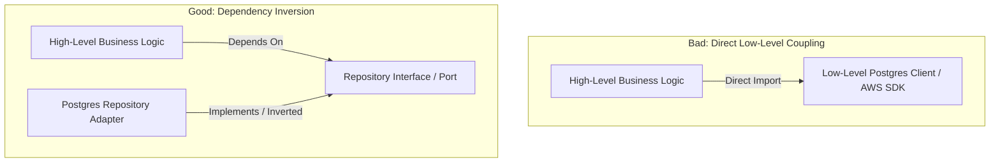

# Dependency Inversion Principle (DIP)

The **Dependency Inversion Principle** establishes the primary structural rule for software dependency direction:
1. **High-level modules should not depend on low-level modules. Both should depend on abstractions.**
2. **Abstractions should not depend on details. Details should depend on abstractions.**

## Core Mental Model & Terminology

DIP is the architectural foundation of Clean Architecture, Hexagonal Architecture (Ports & Adapters), and Onion Architecture.



### Clarifying Key Distinctions
- **Dependency Inversion Principle (DIP):** The high-level architectural rule governing dependency direction (high-level policy owns the contract).
- **Dependency Injection (DI):** A behavioral technique for supplying an external dependency (via constructor arguments, factory functions, or React context) rather than instantiating it internally (`new SpecificDatabaseClient()`).
- **Inversion of Control (IoC):** A framework architectural pattern where external framework lifecycle controls execution flow.

## Invariants & Rules in TypeScript

1. **High-Level Domain Ownership:** Core business services (`OrderService`, `PaymentService`) must import and depend on domain interfaces or ports, never on concrete ORM clients (e.g., Prisma, Kysely), SDK instances, or third-party APIs directly.
2. **Constructor Parameter Injection:** Concrete implementations must be passed into classes or factory functions via constructor parameters or parameter objects:
   ```typescript
   export class OrderService {
     constructor(private readonly orderRepo: OrderRepository, private readonly notifier: NotificationPort) {}
   }
   ```
3. **Frontend Context as Inversion Mechanism:** In React, avoid hardcoding singleton API clients inside UI components; inject dependencies via React Context providers, custom hooks, or props to facilitate isolated storybook rendering and unit testing.

## Cross-References

- Rule Enforcement: [[rules/solid/dependency-inversion|Dependency Inversion Rule]]
- Module Architecture: [[rules/typescript/backend/module-architecture|Backend Module Architecture]]
- Service Layer: [[rules/typescript/backend/service-layer|Service Layer]]
