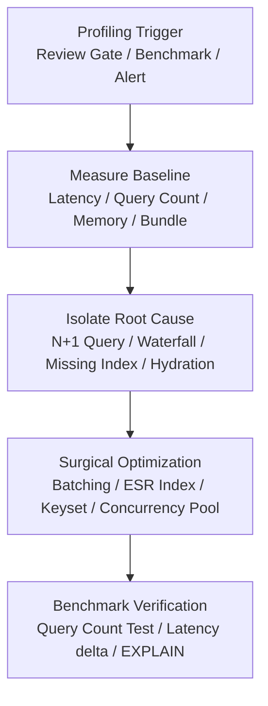

# Runtime Profiling & Performance Optimization

Profile, identify, and eliminate runtime bottlenecks, inefficient database queries, async concurrency hazards, memory leaks, and bundle bloat with evidence-backed measurements.

## Overview & Mental Model

The `perf` skill transforms suspected performance degradations into verified, measurable optimizations. It treats performance as an empirical engineering discipline: measure before and after, optimize algorithms and I/O access patterns, and prevent regression with automated tests.



---

## When to Invoke

- **Manual Invocation:** Triggered explicitly via `/perf <target>`, `[PERF]`, or requests to "optimize queries", "fix N+1", "reduce latency", or "audit bundle size".
- **Review Gate Remediation:** Proactively invoked when `/review` (Gate 4 Language Rules Conformance Audit) detects:
  - Database queries executing inside loops (ORM N+1 anti-pattern).
  - Unindexed dynamic filtering violating the ESR rule.
  - Unbounded `Promise.all` loops exhausting database connection pools.
  - Chained sequential `await` calls creating artificial network waterfalls.

---

## The 5 Optimization Dimensions

### 1. Database Queries & ORM N+1 Elimination

- **Eliminate N+1 Queries:**
  - *Anti-Pattern:* Iterating over a collection and executing an individual query for each item (`for (const item of items) await db.query(...)`).
  - *Remediation:* Batch child entity retrieval into a single query using `WHERE parent_id IN (...)` or structured SQL joins/CTEs, and reconstruct the graph in memory via Map lookups.
- **The ESR (Equality, Sort, Range) Indexing Rule:**
  - Structure composite database indexes matching query clauses in exact order:
    1. **Equality (`=`):** Columns matched on exact values in `WHERE` clauses (e.g. `tenant_id`, `status`).
    2. **Sort (`ORDER BY`):** Columns determining sort direction (e.g. `created_at DESC`, `id DESC`).
    3. **Range (`<`, `>`, `BETWEEN`, `IN`):** Columns filtered by ranges or multi-value sets.
- **Keyset / Cursor Pagination:**
  - Default to keyset pagination on ordered tuples `(created_at, id)` with `LIMIT :limit + 1` for infinite feeds and large collections.
  - Prohibit unbounded `OFFSET 100000` scans that degrade with $O(N)$ full-table scans.
- **Explicit Column Selection:**
  - Always select explicit columns (`select(['id', 'title', 'status'])`). Strictly ban `SELECT *` or `selectAll()` across production tables.

### 2. Async Concurrency & Waterfall Elimination

- **Waterfall Elimination:**
  - Identify independent I/O tasks executed sequentially (`await a(); await b();`) and parallelize them via `Promise.all([a(), b()])` or `Promise.allSettled`.
- **Connection Pool Protection (`p-limit`):**
  - Never run unbounded `Promise.all(thousandsOfTasks.map(...))`.
  - Enforce concurrency pool limiters (`p-limit`, max concurrency 10–25) for batch jobs to prevent database pool exhaustion or HTTP socket saturation.
- **Query Cancellation & AbortSignals:**
  - Pass incoming HTTP request `AbortSignal` into database queries and fetch calls to immediately abort server work when clients disconnect.
- **Zero External Network Calls Inside Open Transactions:**
  - Never execute external third-party API calls (Stripe, SendGrid, S3) inside open database transactions. Prepare data first, execute the external call, then commit the database transaction.

### 3. Memory Leaks & Hydration Overhead

- **Bypass Heavy ORM Hydration in Read Paths:**
  - Avoid hydrating hundreds of active-record class instances when only read-only JSON is needed. Use raw SQL query builders (Kysely) for high-volume reads.
- **Stream Processing for Large Datasets:**
  - Use database cursors or Node.js streams (`ReadableStream`) instead of loading millions of rows into an in-memory array.
- **Resource & Listener Cleanup:**
  - Ensure timers, event listeners, WebSocket channels, and file handles are explicitly closed and dereferenced.

### 4. Bundle Size & Tree-Shaking Audits

- **Replace Monolithic Imports:**
  - Replace fat libraries with modular alternatives (e.g. `lodash-es` instead of `lodash`, `date-fns` instead of `moment`).
- **Code-Splitting & Lazy Loading:**
  - Wrap rarely visited admin dialogs, rich-text editors, and chart visualizations in dynamic imports (`React.lazy()` / `import()`).

### 5. Frontend Rendering & Hook Memoization

- **Computation Memoization:**
  - Wrap CPU-heavy data transformations in `useMemo` with stable dependency arrays.
- **Callback Stability:**
  - Wrap event handlers passed to memoized children in `useCallback`.
- **State Decoupling:**
  - Do not keep rapidly changing state (e.g. scroll position, mouse coordinates) in the root context; isolate it into localized leaf components.

---

## Code Patterns & Remediation Examples

### Database: N+1 Query Elimination

```typescript
// ❌ BAD: N+1 query loop
const users = await db.selectFrom('users').selectAll().execute();
for (const user of users) {
  // Executes 1 query per user (N queries)
  user.posts = await db.selectFrom('posts').where('user_id', '=', user.id).execute();
}

// ✅ GOOD: 2 queries total with in-memory map grouping
const users = await db.selectFrom('users').select(['id', 'name']).execute();
const userIds = users.map((u) => u.id);

const posts = await db
  .selectFrom('posts')
  .select(['id', 'user_id', 'title'])
  .where('user_id', 'in', userIds)
  .execute();

const postsByUserId = Map.groupBy(posts, (p) => p.user_id);
const result = users.map((u) => ({
  ...u,
  posts: postsByUserId.get(u.id) ?? [],
}));
```

### Async: Bounded Concurrency Pool

```typescript
// ❌ BAD: Unbounded parallel execution (crashes DB pool)
await Promise.all(recordIds.map((id) => processRecord(id)));

// ✅ GOOD: Bounded concurrency pool protecting resources
import pLimit from 'p-limit';

const limit = pLimit(15); // Max 15 concurrent operations
await Promise.all(recordIds.map((id) => limit(() => processRecord(id))));
```

---

## Cross-Skill Handoffs

- **From `/review`:** When Gate 4 audits detect unindexed lookups, N+1 query loops, or unbounded async waterfalls, the reviewer rejects the unit and instructs the agent to invoke `/perf`.
- **To `/refactor`:** When resolving a bottleneck requires splitting god-services or extracting caching layers, invoke `skills/engineering/refactor/SKILL.md`.
- **To `/test`:** Verify every optimization with a dedicated performance or query-count test in `skills/engineering/test/SKILL.md`.

---

## Verification Checklist

1. [ ] **Baseline Captured:** Latency, query count, or memory consumption measured before modification.
2. [ ] **ESR Conformance:** Database indexes verified using `EXPLAIN ANALYZE` to confirm index seek over full-table scan.
3. [ ] **Query Count Bounded:** Endpoint executes a constant $O(1)$ number of queries regardless of result set size.
4. [ ] **Connection Safe:** Batch I/O utilizes bounded concurrency limiters.
5. [ ] **Behavior Preserved:** All existing unit and contract tests continue to pass with zero functional regressions.
