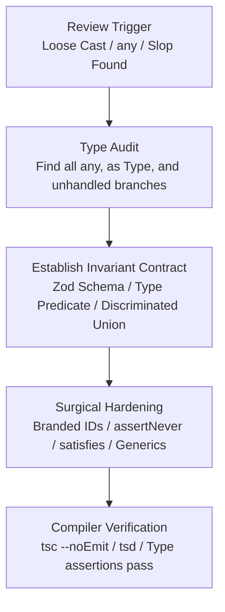

# Static Type Hardening & Anti-Slop Safeguards

Systematically eliminate `any`, remove dangerous type assertions, enforce discriminated unions, and establish compile-time invariant guarantees across TypeScript codebases.

## Overview & Mental Model

The `types` skill is an aggressive quality gate and hardening workflow. It directly combats **"Type Slop"**—the failure mode where LLMs take shortcuts by using `any`, loose `as unknown as T` casts, unvalidated dictionary records, or non-exhaustive switches when solving tricky type errors.



---

## When to Invoke

- **Manual Invocation:** Triggered explicitly via `/types <file_or_target>`, `[TYPES]`, or requests to "harden types", "fix any", "remove casts", or "add discriminated unions".
- **Review Gate Remediation:** Proactively invoked when `/review` (Gate 3 SOLID Audit or Gate 4 Language Rules Conformance Audit) detects:
  - Banned `any` in parameter, variable, or return types.
  - Blind type casting (`as User`, `as any`, `as unknown as Response`).
  - Missing default/exhaustive handling on discriminated union switches.
  - Loose `Record<string, any>` or untyped API responses.

---

## The 5 Type-Hardening Pillars

### 1. Elimination of `any` & Loose Casts

- **The Zero-`any` Invariant:**
  - `any` disables the TypeScript type checker for that variable and propagates virally to every consumer.
  - *Remediation:* Replace `any` with `unknown`. Before consuming `unknown`, narrow it using:
    1. **Runtime validation schemas:** Parse with Zod or Valibot (`userSchema.parse(data)`).
    2. **Custom type guards:** Write predicate functions (`function isUser(val: unknown): val is User`).
    3. **Primitive narrowing:** Check `typeof val === 'string'` or `'id' in val`.
- **Eliminate `as Type` Bypasses:**
  - Forbid type assertions (`obj as MyType`) used to silence compiler diagnostics.
  - Use `satisfies MyContract` when you want to validate that an object adheres to a contract without widening literal values or losing exact property inference.

### 2. Discriminated Unions & Exhaustiveness

- **Model Multi-State Entities as Tagged Unions:**
  - Instead of a single "bag of optional fields" (`{ status: string, data?: T, error?: Error, progress?: number }`), model state as a discriminated union:
    ```typescript
    type AsyncState<T> =
      | { readonly status: 'idle' }
      | { readonly status: 'loading'; readonly progress: number }
      | { readonly status: 'success'; readonly data: T }
      | { readonly status: 'error'; readonly error: Error };
    ```
- **Enforce Exhaustive Branch Checking (`assertNever`):**
  - All switches handling discriminated unions must include an unreachable default branch invoking `assertNever`:
    ```typescript
    export function assertNever(value: never): never {
      throw new Error(`Unhandled discriminated union member: ${JSON.stringify(value)}`);
    }
    ```
  - If a new variant is added to the union later, the compiler will refuse to compile until that branch is handled.

### 3. Branded / Nominal Identifiers

- **Prevent ID Transposition Bugs:**
  - Raw strings (`string`) allow accidentally passing an `orderId` to a function expecting a `userId`.
  - Enforce compile-time branded types for entity identifiers:
    ```typescript
    export type Brand<K, T> = K & { readonly __brand: T };

    export type UserId = Brand<string, 'UserId'>;
    export type OrderId = Brand<string, 'OrderId'>;

    export function toUserId(raw: string): UserId {
      if (!raw || typeof raw !== 'string') throw new Error('Invalid UserId');
      return raw as UserId;
    }
    ```

### 4. Generic Discipline & Constraints

- **Bounded Generics Over Unconstrained Types:**
  - Never use unbounded `<T>`. Constrain generic type parameters with `extends`:
    ```typescript
    // ❌ BAD: Completely unconstrained
    function getProperty<T, K>(obj: T, key: K): any

    // ✅ GOOD: Bounded and type-safe
    function getProperty<T extends object, K extends keyof T>(obj: T, key: K): T[K]
    ```
- **Avoid Recursive Type Traps:**
  - Avoid deeply recursive type gymnastics (e.g. deeply nested deep-partial types) that exhaust compiler memory and degrade IDE autocomplete.

### 5. Type Narrowing vs. Type Casting

- **Type Predicate Functions:**
  - When inspecting complex runtime objects, build pure type predicates that check fields explicitly:
    ```typescript
    export function isApiResponse(value: unknown): value is { data: unknown; status: number } {
      return (
        typeof value === 'object' &&
        value !== null &&
        'status' in value &&
        typeof (value as { status: unknown }).status === 'number'
      );
    }
    ```

---

## Anti-Slop Code Refactoring Patterns

### Eliminating `as any` in API Responses

```typescript
// ❌ SLOPPY: Blind cast disabling all type safety
async function fetchUserProfile(id: string): Promise<UserProfile> {
  const res = await fetch(`/api/users/${id}`);
  const data = await res.json();
  return data as any; // Compiler is silenced, runtime crashes if schema drifts
}

// ✅ HARDENED: Runtime schema validation with inferred static type
import { z } from 'zod';

export const UserProfileSchema = z.object({
  id: z.string().uuid(),
  displayName: z.string().min(1),
  email: z.string().email(),
  role: z.enum(['admin', 'member', 'guest']),
});

export type UserProfile = z.infer<typeof UserProfileSchema>;

async function fetchUserProfile(id: string): Promise<UserProfile> {
  const res = await fetch(`/api/users/${id}`);
  const json: unknown = await res.json();
  return UserProfileSchema.parse(json);
}
```

### Exhaustive Discriminated Union Handling

```typescript
// ❌ SLOPPY: Loose string status with missing branches
function renderBadge(status: string) {
  if (status === 'active') return 'Active';
  if (status === 'pending') return 'Pending';
  return 'Unknown'; // Silent fallback hides missing statuses
}

// ✅ HARDENED: Exhaustive switch with compile-time check
type AccountStatus = 'active' | 'pending' | 'suspended' | 'archived';

function renderBadge(status: AccountStatus): string {
  switch (status) {
    case 'active':
      return 'Active';
    case 'pending':
      return 'Pending';
    case 'suspended':
      return 'Suspended';
    case 'archived':
      return 'Archived';
    default:
      return assertNever(status); // Fails compilation if a 5th status is added
  }
}
```

---

## Cross-Skill Handoffs

- **From `/review`:** When Gate 3 or Gate 4 flags `any`, loose casts, or unvalidated input, invoke `/types`.
- **To `/refactor`:** When type hardening requires extracting new interfaces or splitting modules, invoke `skills/engineering/refactor/SKILL.md`.
- **To `/test`:** Verify complex types using type tests (`tsc --noEmit`, `tsd`, or `expect-type`) in `skills/engineering/test/SKILL.md`.

---

## Verification Checklist

1. [ ] **Zero `any`:** `grep -rn 'any' <target>` yields zero unmitigated occurrences.
2. [ ] **Zero Unsafe Casts:** `as <Type>` assertions replaced by runtime schemas, type predicates, or `satisfies`.
3. [ ] **Exhaustiveness Guaranteed:** All union switch statements terminate in `assertNever`.
4. [ ] **Compile Clean:** `tsc --noEmit` exits with code 0 and zero type diagnostics.
5. [ ] **Runtime Safe:** Validation schemas prevent malformed external data from entering application core.
