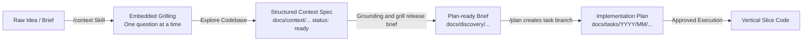

# Author & Grill Context Specifications Before Planning

Remain in discovery and context formulation. Do not write production code or jump prematurely into implementation.

## Access declaration

- **Reads:** the user brief, repository evidence, applicable rules, decisions, and source contracts.
- **Writes:** its own context specification under `docs/context/`.
- **Exposes to:** `grounding` and `grill` only.

Do not hand the context specification directly to `plan`, `plan-review`, `execute`, or another downstream skill. `grill` owns the released discovery brief.

## Overview & Mental Model

The `context` skill transforms raw product concepts, user requests, or bug reports into unambiguous, high-fidelity context specifications under `docs/context/`. It embeds the `grill` discovery methodology to interrogate requirements, scenarios, and constraints *before* grounding and brief release.

## Session Procedure

### 1. Identify Target & Initialize Specification

- Determine the domain or feature name (e.g. `auth/social-login`, `billing/stripe-checkout`, `fixes/session-timeout`).
- Check if an existing context document exists in `docs/context/`. If not, initialize a new specification file (e.g., `docs/context/features/<domain>/<feature>.md` or `docs/context/fixes/<date>-<feature>.md`) using [[docs/templates/Context|Context Template]] (`docs/templates/Context.md`).
- Set frontmatter `status: draft`.
- Record evidence with source path, heading or symbol, verification state, and consequence. Classify every gap as an assumption, an unknown with an owner, or a blocker. A material unknown keeps the specification `draft`.

### 2. Embedded Grilling & Discovery

- Apply the `grill` interview discipline directly:
  - Interrogate the core problem, user personas, desired business value, happy-path journeys, edge cases, and non-goals.
  - Ask **exactly one unresolved question at a time**, explaining why it matters and providing recommended options with clear trade-offs.
  - Inspect existing repository source files, tests, configuration, schemas, and ADRs (`explore`) to resolve facts that code can already answer without asking the user.
- Formulate concrete happy-path, boundary, failure, abuse, concurrency, and lifecycle scenarios.
- Do not turn an assumption into a decision without recorded evidence or user confirmation.

### 3. Structure & Document Context Sections

Record all clarified decisions directly into the context specification according to the template sections:

- **1. Overview & Objective:** Problem statement, user/business value, and measurable success criteria.
- **2. Requirements & User Stories:**
  - User stories in standard format (*"As a [role], I want to [action], so that [benefit]"*).
  - Concrete functional requirements checklist.
  - Explicit edge cases, failure modes, and graceful recovery paths.
- **3. Technical & Architectural Context:**
  - Affected layers (`web/`, `api/`, `mobile/`, database).
  - Language Stack & Rules: Identify the active technology stack (via `context-cli preflight` or `node scripts/context.mjs resolve "<task description>"`) and record candidate directive IDs (e.g. `ts.type-safety.ban-any`), modes (`automated-blocking`, `evidence-blocking`, `advisory`), and key architectural constraints that govern this feature.
  - Existing reference files, endpoints, or data models to inspect or modify.
  - Schema changes and migrations.
  - Security, authorization (RBAC/tenant isolation), and input sanitization boundaries.
- **4. UI/UX & Interaction Guidelines (if applicable):** Layout, visual tokens, loading skeletons, error states, and toasts.
- **5. Scope & Boundaries:** Explicit in-scope deliverables vs. strictly out-of-scope non-goals.
- **6. References & External Context:** Links to relevant ADRs ([[docs/decisions/README|Decisions]]), Figma, PRDs, or prior tasks.

### 4. Quality Audit & Readiness Gate

Do not mark the context specification as `ready` until:

- Measurable success criteria and outcomes are explicit;
- Every actor and permission boundary is identified;
- Applicable language stack rules, directive IDs, and enforcement modes are identified and recorded;
- Primary journeys and edge cases have defined failure/recovery behaviors;
- In-scope vs. non-goal boundaries prevent scope expansion;
- Technical contracts and database/schema impacts are clearly bounded;
- Unresolved assumptions are resolved or explicitly marked as blockers;
- The user confirms the shared understanding.

Do not mark the context `ready` while a material unknown or blocker remains.

### 5. Synchronization & Handoff to `grounding` / `grill`

- Once audited and confirmed, update the frontmatter to `status: ready`.
- Supply the ready context specification only to `grounding` and `grill`. `grounding` returns provenance-labeled claims to `grill`; `grill` challenges the evidence and releases the sole plan-facing brief.
- Do not create or switch a task branch. Branch creation belongs to `plan` after the brief is released and before plan artifacts are written.
- Stop without writing production code.

## Completion

Return the created context specification path (e.g. `docs/context/features/<domain>/<feature>.md`), a summary of resolved decisions and scenarios, and a recommendation on readiness for `/plan`.
