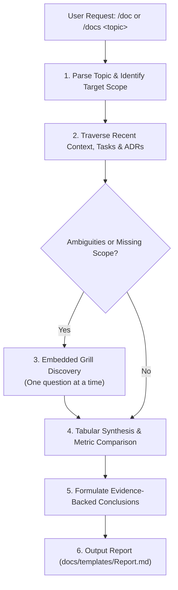

# Synthesize Documentation & System Reports

The `docs` skill transforms user reporting and documentation requests into structured, comparative, and conclusion-driven reports under `docs/reports/` (or designated documentation target). It enforces strict historical inspection across recent context specifications (`docs/context/`), implementation tasks (`docs/tasks/`), and architectural decision records (`docs/decisions/`), embedding the `grill` discovery discipline whenever parameters or goals require clarification.

---

## Operating Procedure

### 1. Request Intake & Scope Parsing

- Identify the requested report topic (e.g. performance mitigation summary, defect post-mortem, architecture change overview, sprint release review).
- Determine the intended audience (executive stakeholder, engineering team, auditor/compliance).
- Identify any specified timeframes, subsystems, or benchmark targets.

### 2. Strict Historical & Evidence Traversal

Before formulating conclusions or drafting summaries, systematically traverse and inspect the project repository:

1. **Context Specifications (`docs/context/`):** Inspect recent specifications for original problem statements, business requirements, constraints, and baseline expectations.
2. **Implementation Tasks (`docs/tasks/`):** Inspect recent task master plans (`README.md`), phase breakdowns (`phase-*.md`), checklists, and recorded verification outputs to identify executed changes and tangible outcomes.
3. **Architecture Decisions (`docs/decisions/`):** Inspect relevant ADRs to cite trade-offs, architectural rationale, and rejected alternatives.
4. **Codebase & Git Evidence:** Inspect git commits, diffs, test suite outputs, or benchmark data to corroborate claimed performance deltas, schema migrations, or defect fixes.

### 3. Embedded Grill Discovery (Ambiguity Gate)

If the user's request lacks critical parameters (e.g. unspecified time range, missing baseline figures, ambiguous subsystem focus, or undefined target format):

- Apply the [[skills/productivity/grill/SKILL|grill]] interview discipline directly.
- Ask **exactly one unresolved question at a time**.
- Provide a clear rationale for why the question matters along with a recommended default and explicit options.
- If the user provides a brief answer or proceeds, record the clarified scope immediately and proceed.

### 4. Tabular Synthesis & Comparative Analysis

Structure all analytical results, performance numbers, and mitigation steps using standardized markdown tables:

#### A. Mitigation & Intervention Table

| ID | Subsystem / Area | Problem / Bottleneck | Mitigation Applied | Touched Files / ADR | Status |
| :--- | :--- | :--- | :--- | :--- | :--- |
| M-01 | Data Layer (`src/db/`) | High latency on unindexed queries | Compound B-tree index + cursor pagination | `rules/typescript/database/` | Completed |

#### B. Results & Metric Impact Matrix

| Metric / KPI | Baseline (Before) | Observed (After) | Delta / Improvement | Verification Evidence |
| :--- | :--- | :--- | :--- | :--- |
| p95 Query Latency | 850ms | 42ms | -95.0% (20x faster) | Benchmark script log |
| Memory Footprint | 512MB | 128MB | -75.0% reduction | Heap profiler dump |
| Test Coverage | 68% | 94% | +26% gain | Fresh `npm test` run |

### 5. Evidence-Backed Conclusion & Recommendations

- Classify all summary statements according to `rules/global/evidence-and-claims.md` (verified facts vs. assumptions vs. recommendations).
- Formulate a decisive conclusion synthesizing what succeeded, what trade-offs were accepted, and what operational monitoring or follow-up tasks remain.
- Avoid vague or unsubstantiated claims; ensure every metric or accomplishment cites concrete files, tasks, or test runs.

### 6. Artifact Generation & Placement

- Scaffolds the final report using [[docs/templates/Report|Report Template]] (`docs/templates/Report.md`).
- Default path: `docs/reports/YYYY/MM/YYYY-MM-DD-<topic>.md` (or host project documentation folder).
- Stop without modifying production code files.

---

## Output Quality Gate

Do not finalize the report until:

- [ ] Problem statement and business context trace directly back to `docs/context/` or user brief.
- [ ] Every listed mitigation maps to verified task files (`docs/tasks/`) or source commits.
- [ ] Performance or quality metrics include explicit baseline (before), result (after), and delta calculations.
- [ ] Architectural choices reference applicable ADRs under `docs/decisions/`.
- [ ] Conclusions provide actionable next steps, risks, or maintenance guidelines.

## Completion

Return the created report path, a summary of the key findings and metric comparisons, and any open recommendations for follow-up development or monitoring.
