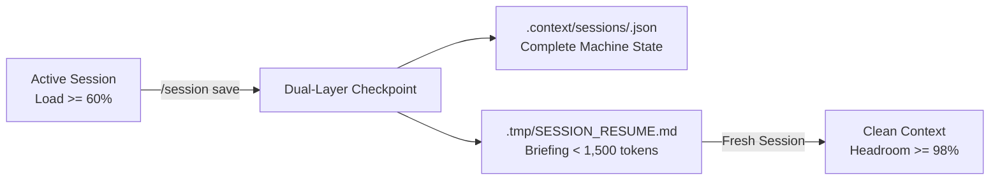

# Session State Persistence & Clean-Context Resume

Manage agent session lifecycle to eliminate context window degradation and ensure high-fidelity execution across LLM interactions.

## Mental Model & The 60% Saturation Rule

Context window degradation occurs when cumulative conversation history consumes >60% of an LLM's effective context window. Above this threshold, reasoning precision, rule adherence, and code quality degrade substantially.

To maximize output fidelity while minimizing input tokens:
- Monitor conversation context saturation during iterative development.
- When context load approaches **~60% saturation**, trigger `/session save` to snapshot machine state and generate an ultra-compact cold-start resume briefing.
- Terminate or start a fresh session, and invoke `/session resume` (or read `.tmp/SESSION_RESUME.md`) to re-hydrate state with 98%+ clean context headroom.



## Slash Commands & CLI Equivalence

| Slash Command | CLI Subcommand | Purpose |
| :--- | :--- | :--- |
| `/session save` | `node scripts/context.mjs session:save` | Snapshot active task, phase, unit, worktree, and git status |
| `/session resume` | `node scripts/context.mjs session:resume [id]` | Load checkpoint and regenerate `.tmp/SESSION_RESUME.md` |
| `/session status` | `node scripts/context.mjs session:status` | Display table of persisted sessions and active state |
| `/session clear` | `node scripts/context.mjs session:clear [id]` | Safely remove session state and clean `.tmp/SESSION_RESUME.md` |

## Lifecycle Procedures

### 1. Saving Active Session State (`/session save`)

Execute before reaching high context saturation or pausing multi-unit tasks:

1. Identify active task directory (`docs/tasks/...`), current phase, active unit, and assigned worktrees.
2. Run the session save command:
   ```bash
   node scripts/context.mjs session:save --task "0001" --phase "03" --unit "03.01" --status "in_progress"
   ```
3. The engine automatically:
   - Validates state against `schemas/session-state.schema.json`.
   - Writes durable machine checkpoint to `.context/sessions/<session-id>.json`.
   - Generates condensed markdown briefing in `.tmp/SESSION_RESUME.md` (<1,500 tokens).
4. Direct the user to start a new session or reset context.

### 2. Resuming in a Clean Session (`/session resume`)

When beginning a new session or resuming after a context reset:

1. Check for available briefings in `.tmp/SESSION_RESUME.md` or invoke:
   ```bash
   node scripts/context.mjs session:resume
   ```
2. Inspect the returned briefing:
   - Verify task identity, goal, and branch.
   - Review the immediate next actions and unblocked units.
   - Validate active worktree paths and git commit SHAs.
3. Resume execution immediately without re-reading extensive conversation history or raw past transcripts.

### 3. Inspecting Status (`/session status`)

To audit active sessions across branches or worktrees:

```bash
node scripts/context.mjs session:status
```

Outputs a structured table listing Session ID, Task ID, Phase, Unit, Git Branch, Worktree, and Last Updated timestamp.

### 4. Clearing Sessions (`/session clear`)

When a task is completed, merged, or abandoned:

```bash
# Clear active session and temporary resume briefing
node scripts/context.mjs session:clear --active

# Clear all historical sessions
node scripts/context.mjs session:clear --all
```

## Guardrails & Best Practices

- **Zero Secrets:** Never serialize passwords, API keys, or raw tokens into `.context/sessions/`.
- **Lightweight Briefings:** Keep `.tmp/SESSION_RESUME.md` under 1,500 tokens. Never dump large source files into session state.
- **Atomic Worktree Alignment:** Ensure recorded worktrees match active `git worktree list` entries.
