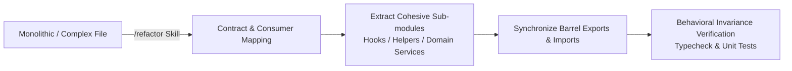

# Modular Code Refactoring

Refactor code to improve modularity, maintainability, readability, and scalability without changing external behavior or breaking existing contracts.

## Overview & Invocation Modes

The `refactor` skill breaks down oversized files handling multiple functions, mixed concerns, or complex state into cohesive, single-responsibility files that stay synchronized.

- **Manual Invocation:** Triggered explicitly via `/refactor <file_or_component>`, `[REFACTOR]`, or requests to "modularize code" / "split this file".
- **Autonomous Recommendation / Execution:** Proactively recommended or applied by the AI when newly generated or reviewed code exceeds complexity thresholds (>200 lines, mixed UI/business logic, or god-services).



## Session Procedure

### 1. Analyze & Target Decomposition
- Inspect the target file and measure its cyclomatic complexity, length, and concerns.
- Identify distinct single-responsibility extraction boundaries:
  - **Frontend / React:**
    - Extract stateful logic and data fetching into custom hooks (`use<Feature>.ts`).
    - Extract presentational sub-components into dedicated component files (`<SubComponent>.tsx`).
    - Extract shared types and schemas into `types.ts` or `<feature>.schemas.ts`.
  - **Backend / Services:**
    - Separate HTTP routing/controller layer from domain business logic (`rules/backend/controllers-and-routes.md`).
    - Separate domain service orchestration from raw database queries (`rules/backend/service-layer.md`, `rules/database/data-access-via-db.md`).
    - Extract shared DTO parsers, utility helpers, and constants.

### 2. Map Contracts & Consumers
- Catalog every exported function, class, type, interface, and constant in the target file.
- Use `explore` or grep search to locate all importing files and consumers across the repository.
- Ensure that no public API contract or database query behavior is altered.

### 3. Surgical Modular Extraction
- Create new, well-named files in the appropriate vertical module or component directory:
  - Keep related files co-located within vertical module boundaries (`rules/backend/module-architecture.md`).
  - Follow naming conventions (`rules/global/naming-conventions.md`).
- Move the targeted functions, hooks, or components cleanly into their new dedicated files.
- Ensure all dependencies and internal helper imports are explicitly resolved.

### 4. Synchronize Imports & Barrel Exports
- Update or create `index.ts` barrel exports to re-export moved symbols if external modules consume them.
- Update all consumer import statements across the codebase simultaneously.
- Check for and eliminate any potential circular dependencies.

### 5. Verify Behavioral Equivalence
- Run the compiler typecheck (`tsc --noEmit` or equivalent) to confirm 100% type safety.
- Run the linter to verify import hygiene.
- Run all existing unit, integration, and regression test suites to guarantee strict behavioral equivalence:
  ```bash
  npm test
  ```
- If any test fails, inspect and fix the extraction or revert cleanly.

## Quality Gates

- Every extracted file has a single, well-defined responsibility.
- No public API signature, route handler contract, or exported type is broken.
- No dead or duplicate code is left behind in the original file.
- All consumers compile cleanly without circular dependencies.
- 100% of affected tests pass with reproducible evidence.
